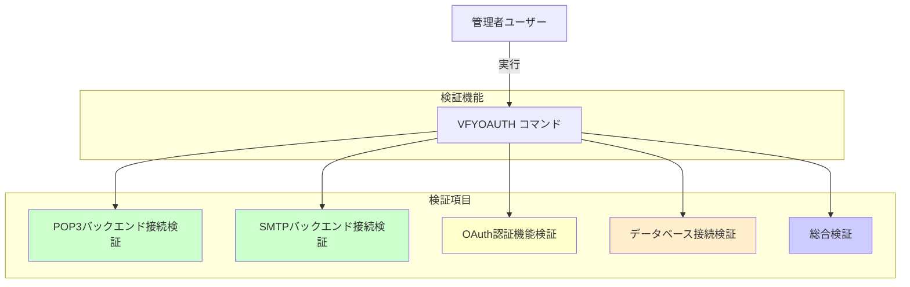
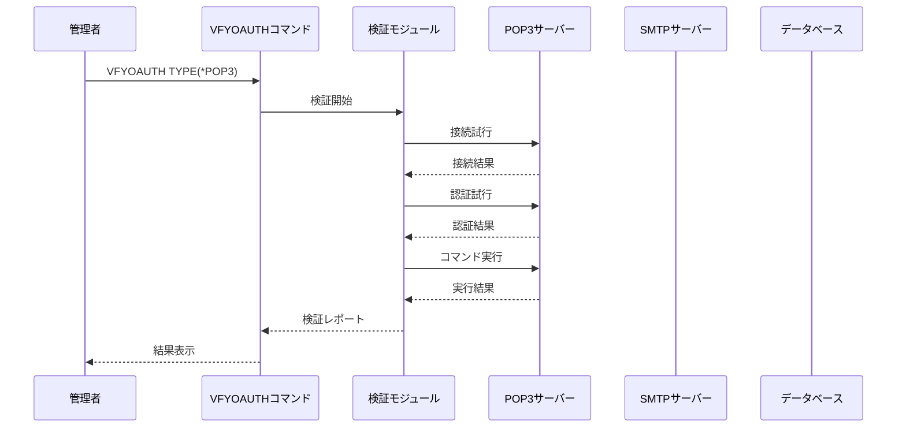

# IBMi OAuth Proxy 事前接続検証機能 設計書

## 1. 機能概要

### 1.1 目的

OAuth認証プロキシの運用開始前に、各コンポーネントの接続状態を個別に検証できる機能を提供します。これにより、問題の早期発見と迅速なトラブルシューティングが可能になります。

### 1.2 検証対象



### 1.3 検証フロー



## 2. コマンド設計

### 2.1 VFYOAUTHコマンド仕様

#### 2.1.1 コマンド定義 (VFYOAUTH.CMD)

```
CMD        PROMPT('OAuth Proxy接続検証')

PARM       KWD(TYPE) TYPE(*CHAR) LEN(10) +
           RSTD(*YES) VALUES(*POP3 *SMTP *OAUTH *DB *ALL) +
           DFT(*ALL) +
           PROMPT('検証タイプ')

PARM       KWD(HOST) TYPE(*CHAR) LEN(256) +
           DFT(*DFT) +
           PROMPT('ホスト名/IPアドレス')

PARM       KWD(PORT) TYPE(*DEC) LEN(5 0) +
           DFT(*DFT) +
           PROMPT('ポート番号')

PARM       KWD(USER) TYPE(*CHAR) LEN(10) +
           DFT(*CURRENT) +
           PROMPT('ユーザー名')

PARM       KWD(PASSWORD) TYPE(*CHAR) LEN(128) +
           DFT(*NONE) +
           PROMPT('パスワード')

PARM       KWD(TIMEOUT) TYPE(*DEC) LEN(3 0) +
           RANGE(1 999) +
           DFT(30) +
           PROMPT('タイムアウト(秒)')

PARM       KWD(OUTPUT) TYPE(*CHAR) LEN(8) +
           RSTD(*YES) VALUES(*PRINT *DISPLAY) +
           DFT(*DISPLAY) +
           PROMPT('出力先')

PARM       KWD(DETAIL) TYPE(*CHAR) LEN(7) +
           RSTD(*YES) VALUES(*BASIC *FULL) +
           DFT(*BASIC) +
           PROMPT('詳細レベル')
```

#### 2.1.2 使用例

```cl
/* POP3バックエンド接続検証 */
VFYOAUTH TYPE(*POP3) HOST('localhost') PORT(110) +
         USER(TESTUSER) PASSWORD('password123')

/* SMTPバックエンド接続検証 */
VFYOAUTH TYPE(*SMTP) HOST('localhost') PORT(25) +
         USER(TESTUSER) PASSWORD('password123')

/* OAuth認証機能検証 */
VFYOAUTH TYPE(*OAUTH) USER(TESTUSER) PASSWORD('password123')

/* データベース接続検証 */
VFYOAUTH TYPE(*DB)

/* 全項目検証 */
VFYOAUTH TYPE(*ALL) USER(TESTUSER) PASSWORD('password123') +
         DETAIL(*FULL) OUTPUT(*PRINT)
```

### 2.2 コマンド処理プログラム (VFYOAUTHC.CLP)

```cl
PGM        PARM(&TYPE &HOST &PORT &USER &PASSWORD &TIMEOUT +
                &OUTPUT &DETAIL)

/* パラメータ定義 */
DCL        VAR(&TYPE) TYPE(*CHAR) LEN(10)
DCL        VAR(&HOST) TYPE(*CHAR) LEN(256)
DCL        VAR(&PORT) TYPE(*DEC) LEN(5 0)
DCL        VAR(&USER) TYPE(*CHAR) LEN(10)
DCL        VAR(&PASSWORD) TYPE(*CHAR) LEN(128)
DCL        VAR(&TIMEOUT) TYPE(*DEC) LEN(3 0)
DCL        VAR(&OUTPUT) TYPE(*CHAR) LEN(8)
DCL        VAR(&DETAIL) TYPE(*CHAR) LEN(7)

DCL        VAR(&RESULT) TYPE(*CHAR) LEN(7)
DCL        VAR(&MSGTEXT) TYPE(*CHAR) LEN(512)

/* デフォルト値設定 */
IF         COND(&HOST *EQ '*DFT') THEN(DO)
    CHGVAR VAR(&HOST) VALUE('localhost')
ENDDO

IF         COND(&PORT *EQ 0) THEN(DO)
    IF     COND(&TYPE *EQ '*POP3') THEN(DO)
        CHGVAR VAR(&PORT) VALUE(110)
    ENDDO
    ELSE IF COND(&TYPE *EQ '*SMTP') THEN(DO)
        CHGVAR VAR(&PORT) VALUE(25)
    ENDDO
ENDDO

IF         COND(&USER *EQ '*CURRENT') THEN(DO)
    RTVJOBA USER(&USER)
ENDDO

/* 検証実行 */
SNDPGMMSG  MSG('OAuth Proxy接続検証を開始します...') +
           TOPGMQ(*EXT)

IF         COND(&TYPE *EQ '*POP3' *OR &TYPE *EQ '*ALL') THEN(DO)
    CALL   PGM(OAUTHLIB/VFYPOP3) +
           PARM(&HOST &PORT &USER &PASSWORD &TIMEOUT +
                &DETAIL &RESULT &MSGTEXT)
    
    IF     COND(&RESULT *EQ '*PASSED') THEN(DO)
        SNDPGMMSG MSG('POP3検証: 成功') TOPGMQ(*EXT)
    ENDDO
    ELSE DO
        SNDPGMMSG MSG('POP3検証: 失敗 - ' *CAT &MSGTEXT) +
                  TOPGMQ(*EXT)
    ENDDO
ENDDO

IF         COND(&TYPE *EQ '*SMTP' *OR &TYPE *EQ '*ALL') THEN(DO)
    CALL   PGM(OAUTHLIB/VFYSMTP) +
           PARM(&HOST &PORT &USER &PASSWORD &TIMEOUT +
                &DETAIL &RESULT &MSGTEXT)
    
    IF     COND(&RESULT *EQ '*PASSED') THEN(DO)
        SNDPGMMSG MSG('SMTP検証: 成功') TOPGMQ(*EXT)
    ENDDO
    ELSE DO
        SNDPGMMSG MSG('SMTP検証: 失敗 - ' *CAT &MSGTEXT) +
                  TOPGMQ(*EXT)
    ENDDO
ENDDO

IF         COND(&TYPE *EQ '*OAUTH' *OR &TYPE *EQ '*ALL') THEN(DO)
    CALL   PGM(OAUTHLIB/VFYOAUTH) +
           PARM(&USER &PASSWORD &TIMEOUT &DETAIL +
                &RESULT &MSGTEXT)
    
    IF     COND(&RESULT *EQ '*PASSED') THEN(DO)
        SNDPGMMSG MSG('OAuth検証: 成功') TOPGMQ(*EXT)
    ENDDO
    ELSE DO
        SNDPGMMSG MSG('OAuth検証: 失敗 - ' *CAT &MSGTEXT) +
                  TOPGMQ(*EXT)
    ENDDO
ENDDO

IF         COND(&TYPE *EQ '*DB' *OR &TYPE *EQ '*ALL') THEN(DO)
    CALL   PGM(OAUTHLIB/VFYDB) +
           PARM(&DETAIL &RESULT &MSGTEXT)
    
    IF     COND(&RESULT *EQ '*PASSED') THEN(DO)
        SNDPGMMSG MSG('データベース検証: 成功') TOPGMQ(*EXT)
    ENDDO
    ELSE DO
        SNDPGMMSG MSG('データベース検証: 失敗 - ' *CAT &MSGTEXT) +
                  TOPGMQ(*EXT)
    ENDDO
ENDDO

/* レポート出力 */
IF         COND(&OUTPUT *EQ '*PRINT') THEN(DO)
    CALL   PGM(OAUTHLIB/VFYRPT) PARM(&TYPE &DETAIL)
ENDDO

SNDPGMMSG  MSG('OAuth Proxy接続検証が完了しました') +
           TOPGMQ(*EXT)

ENDPGM
```

## 3. ILE-C検証モジュール実装

### 3.1 POP3接続検証 (VFYPOP3.C)

```c
/**
 * POP3バックエンド接続検証モジュール
 */

#include <stdio.h>
#include <stdlib.h>
#include <string.h>
#include <unistd.h>
#include <sys/socket.h>
#include <netinet/in.h>
#include <netdb.h>
#include <errno.h>
#include <time.h>

#include "verify.h"
#include "logger.h"

#define BUFFER_SIZE 4096

/* 検証結果構造体 */
typedef struct {
    int connection_ok;
    int authentication_ok;
    int command_ok;
    double connection_time;
    double auth_time;
    double total_time;
    char error_message[512];
    char server_banner[256];
    char server_capabilities[512];
} POP3_VerifyResult;

/* タイムスタンプ取得 */
static double get_timestamp(void) {
    struct timespec ts;
    clock_gettime(CLOCK_MONOTONIC, &ts);
    return ts.tv_sec + ts.tv_nsec / 1000000000.0;
}

/* POP3サーバーに接続 */
static int connect_pop3_server(const char *host, int port, 
                               int timeout, int *sock_out,
                               char *banner, size_t banner_len) {
    int sock;
    struct sockaddr_in server_addr;
    struct hostent *server;
    struct timeval tv;
    char buffer[BUFFER_SIZE];
    int n;
    
    /* ソケット作成 */
    sock = socket(AF_INET, SOCK_STREAM, 0);
    if (sock < 0) {
        snprintf(banner, banner_len, "ソケット作成失敗: %s", 
                strerror(errno));
        return -1;
    }
    
    /* タイムアウト設定 */
    tv.tv_sec = timeout;
    tv.tv_usec = 0;
    setsockopt(sock, SOL_SOCKET, SO_RCVTIMEO, &tv, sizeof(tv));
    setsockopt(sock, SOL_SOCKET, SO_SNDTIMEO, &tv, sizeof(tv));
    
    /* ホスト名解決 */
    server = gethostbyname(host);
    if (server == NULL) {
        snprintf(banner, banner_len, "ホスト名解決失敗: %s", host);
        close(sock);
        return -1;
    }
    
    /* 接続 */
    memset(&server_addr, 0, sizeof(server_addr));
    server_addr.sin_family = AF_INET;
    memcpy(&server_addr.sin_addr.s_addr, server->h_addr, server->h_length);
    server_addr.sin_port = htons(port);
    
    if (connect(sock, (struct sockaddr*)&server_addr, 
                sizeof(server_addr)) < 0) {
        snprintf(banner, banner_len, "接続失敗: %s", strerror(errno));
        close(sock);
        return -1;
    }
    
    /* バナー受信 */
    n = recv(sock, buffer, sizeof(buffer) - 1, 0);
    if (n <= 0) {
        snprintf(banner, banner_len, "バナー受信失敗");
        close(sock);
        return -1;
    }
    
    buffer[n] = '\0';
    strncpy(banner, buffer, banner_len - 1);
    banner[banner_len - 1] = '\0';
    
    /* +OKチェック */
    if (strncmp(buffer, "+OK", 3) != 0) {
        close(sock);
        return -1;
    }
    
    *sock_out = sock;
    return 0;
}

/* POP3認証テスト */
static int test_pop3_auth(int sock, const char *username, 
                         const char *password, char *error_msg,
                         size_t error_len) {
    char buffer[BUFFER_SIZE];
    char command[256];
    int n;
    
    /* USERコマンド */
    snprintf(command, sizeof(command), "USER %s\r\n", username);
    if (send(sock, command, strlen(command), 0) < 0) {
        snprintf(error_msg, error_len, "USERコマンド送信失敗");
        return -1;
    }
    
    n = recv(sock, buffer, sizeof(buffer) - 1, 0);
    if (n <= 0 || strncmp(buffer, "+OK", 3) != 0) {
        buffer[n] = '\0';
        snprintf(error_msg, error_len, "USERコマンド失敗: %s", buffer);
        return -1;
    }
    
    /* PASSコマンド */
    snprintf(command, sizeof(command), "PASS %s\r\n", password);
    if (send(sock, command, strlen(command), 0) < 0) {
        snprintf(error_msg, error_len, "PASSコマンド送信失敗");
        return -1;
    }
    
    n = recv(sock, buffer, sizeof(buffer) - 1, 0);
    if (n <= 0 || strncmp(buffer, "+OK", 3) != 0) {
        buffer[n] = '\0';
        snprintf(error_msg, error_len, "PASSコマンド失敗: %s", buffer);
        return -1;
    }
    
    return 0;
}

/* POP3コマンドテスト */
static int test_pop3_commands(int sock, char *capabilities,
                             size_t cap_len, char *error_msg,
                             size_t error_len) {
    char buffer[BUFFER_SIZE];
    char command[256];
    int n;
    
    /* STATコマンド */
    strcpy(command, "STAT\r\n");
    if (send(sock, command, strlen(command), 0) < 0) {
        snprintf(error_msg, error_len, "STATコマンド送信失敗");
        return -1;
    }
    
    n = recv(sock, buffer, sizeof(buffer) - 1, 0);
    if (n <= 0 || strncmp(buffer, "+OK", 3) != 0) {
        buffer[n] = '\0';
        snprintf(error_msg, error_len, "STATコマンド失敗: %s", buffer);
        return -1;
    }
    
    buffer[n] = '\0';
    strncpy(capabilities, buffer, cap_len - 1);
    capabilities[cap_len - 1] = '\0';
    
    /* LISTコマンド */
    strcpy(command, "LIST\r\n");
    if (send(sock, command, strlen(command), 0) < 0) {
        snprintf(error_msg, error_len, "LISTコマンド送信失敗");
        return -1;
    }
    
    /* 応答読み飛ばし */
    while (1) {
        n = recv(sock, buffer, sizeof(buffer) - 1, 0);
        if (n <= 0) break;
        buffer[n] = '\0';
        if (strstr(buffer, "\r\n.\r\n") != NULL) break;
    }
    
    return 0;
}

/* POP3検証メイン関数 */
int verify_pop3(const char *host, int port, const char *username,
               const char *password, int timeout, int detail_level,
               char *result, char *message) {
    POP3_VerifyResult vr;
    int sock = -1;
    double start_time, end_time;
    
    memset(&vr, 0, sizeof(vr));
    
    log_info("POP3検証開始: %s:%d", host, port);
    
    /* 接続テスト */
    start_time = get_timestamp();
    if (connect_pop3_server(host, port, timeout, &sock, 
                           vr.server_banner, 
                           sizeof(vr.server_banner)) == 0) {
        vr.connection_ok = 1;
        end_time = get_timestamp();
        vr.connection_time = end_time - start_time;
        
        log_info("POP3接続成功: %.3f秒", vr.connection_time);
        
        /* 認証テスト */
        start_time = get_timestamp();
        if (test_pop3_auth(sock, username, password, 
                          vr.error_message, 
                          sizeof(vr.error_message)) == 0) {
            vr.authentication_ok = 1;
            end_time = get_timestamp();
            vr.auth_time = end_time - start_time;
            
            log_info("POP3認証成功: %.3f秒", vr.auth_time);
            
            /* コマンドテスト */
            if (test_pop3_commands(sock, vr.server_capabilities,
                                  sizeof(vr.server_capabilities),
                                  vr.error_message,
                                  sizeof(vr.error_message)) == 0) {
                vr.command_ok = 1;
                log_info("POP3コマンド実行成功");
            } else {
                log_warning("POP3コマンド実行失敗: %s", 
                          vr.error_message);
            }
        } else {
            log_warning("POP3認証失敗: %s", vr.error_message);
        }
        
        /* 切断 */
        send(sock, "QUIT\r\n", 6, 0);
        close(sock);
    } else {
        log_error("POP3接続失敗: %s", vr.server_banner);
        strcpy(vr.error_message, vr.server_banner);
    }
    
    vr.total_time = vr.connection_time + vr.auth_time;
    
    /* 結果判定 */
    if (vr.connection_ok && vr.authentication_ok && vr.command_ok) {
        strcpy(result, "*PASSED");
        snprintf(message, 512, 
                "POP3検証成功 (接続: %.3fs, 認証: %.3fs, 合計: %.3fs)",
                vr.connection_time, vr.auth_time, vr.total_time);
    } else {
        strcpy(result, "*FAILED");
        snprintf(message, 512, "POP3検証失敗: %s", vr.error_message);
    }
    
    /* 詳細レポート出力 */
    if (detail_level > 0) {
        printf("\n=== POP3接続検証レポート ===\n");
        printf("ホスト: %s:%d\n", host, port);
        printf("接続: %s (%.3f秒)\n", 
               vr.connection_ok ? "成功" : "失敗", 
               vr.connection_time);
        if (vr.connection_ok) {
            printf("バナー: %s\n", vr.server_banner);
        }
        printf("認証: %s (%.3f秒)\n", 
               vr.authentication_ok ? "成功" : "失敗", 
               vr.auth_time);
        printf("コマンド実行: %s\n", 
               vr.command_ok ? "成功" : "失敗");
        if (vr.command_ok && detail_level > 1) {
            printf("サーバー情報: %s\n", vr.server_capabilities);
        }
        printf("合計時間: %.3f秒\n", vr.total_time);
        if (!vr.connection_ok || !vr.authentication_ok || !vr.command_ok) {
            printf("エラー: %s\n", vr.error_message);
        }
        printf("===========================\n\n");
    }
    
    return vr.connection_ok && vr.authentication_ok && vr.command_ok ? 0 : -1;
}
```

### 3.2 SMTP接続検証 (VFYSMTP.C)

```c
/**
 * SMTPバックエンド接続検証モジュール
 */

#include <stdio.h>
#include <stdlib.h>
#include <string.h>
#include <unistd.h>
#include <sys/socket.h>
#include <netinet/in.h>
#include <netdb.h>
#include <errno.h>
#include <time.h>

#include "verify.h"
#include "logger.h"

#define BUFFER_SIZE 4096

/* 検証結果構造体 */
typedef struct {
    int connection_ok;
    int ehlo_ok;
    int authentication_ok;
    int mail_from_ok;
    double connection_time;
    double auth_time;
    double total_time;
    char error_message[512];
    char server_banner[256];
    char server_capabilities[1024];
} SMTP_VerifyResult;

/* SMTPサーバーに接続 */
static int connect_smtp_server(const char *host, int port, 
                               int timeout, int *sock_out,
                               char *banner, size_t banner_len) {
    int sock;
    struct sockaddr_in server_addr;
    struct hostent *server;
    struct timeval tv;
    char buffer[BUFFER_SIZE];
    int n;
    
    /* ソケット作成 */
    sock = socket(AF_INET, SOCK_STREAM, 0);
    if (sock < 0) {
        snprintf(banner, banner_len, "ソケット作成失敗: %s", 
                strerror(errno));
        return -1;
    }
    
    /* タイムアウト設定 */
    tv.tv_sec = timeout;
    tv.tv_usec = 0;
    setsockopt(sock, SOL_SOCKET, SO_RCVTIMEO, &tv, sizeof(tv));
    setsockopt(sock, SOL_SOCKET, SO_SNDTIMEO, &tv, sizeof(tv));
    
    /* ホスト名解決 */
    server = gethostbyname(host);
    if (server == NULL) {
        snprintf(banner, banner_len, "ホスト名解決失敗: %s", host);
        close(sock);
        return -1;
    }
    
    /* 接続 */
    memset(&server_addr, 0, sizeof(server_addr));
    server_addr.sin_family = AF_INET;
    memcpy(&server_addr.sin_addr.s_addr, server->h_addr, server->h_length);
    server_addr.sin_port = htons(port);
    
    if (connect(sock, (struct sockaddr*)&server_addr, 
                sizeof(server_addr)) < 0) {
        snprintf(banner, banner_len, "接続失敗: %s", strerror(errno));
        close(sock);
        return -1;
    }
    
    /* バナー受信 */
    n = recv(sock, buffer, sizeof(buffer) - 1, 0);
    if (n <= 0) {
        snprintf(banner, banner_len, "バナー受信失敗");
        close(sock);
        return -1;
    }
    
    buffer[n] = '\0';
    strncpy(banner, buffer, banner_len - 1);
    banner[banner_len - 1] = '\0';
    
    /* 220チェック */
    if (strncmp(buffer, "220", 3) != 0) {
        close(sock);
        return -1;
    }
    
    *sock_out = sock;
    return 0;
}

/* SMTP EHLOテスト */
static int test_smtp_ehlo(int sock, char *capabilities,
                         size_t cap_len, char *error_msg,
                         size_t error_len) {
    char buffer[BUFFER_SIZE];
    char command[256];
    int n;
    char hostname[256];
    
    /* ホスト名取得 */
    gethostname(hostname, sizeof(hostname));
    
    /* EHLOコマンド */
    snprintf(command, sizeof(command), "EHLO %s\r\n", hostname);
    if (send(sock, command, strlen(command), 0) < 0) {
        snprintf(error_msg, error_len, "EHLOコマンド送信失敗");
        return -1;
    }
    
    /* 応答受信（複数行） */
    capabilities[0] = '\0';
    while (1) {
        n = recv(sock, buffer, sizeof(buffer) - 1, 0);
        if (n <= 0) {
            snprintf(error_msg, error_len, "EHLO応答受信失敗");
            return -1;
        }
        
        buffer[n] = '\0';
        strncat(capabilities, buffer, cap_len - strlen(capabilities) - 1);
        
        /* 最終行チェック（250 で始まる行） */
        if (strncmp(buffer, "250 ", 4) == 0) break;
    }
    
    if (strncmp(capabilities, "250", 3) != 0) {
        snprintf(error_msg, error_len, "EHLOコマンド失敗: %s", 
                capabilities);
        return -1;
    }
    
    return 0;
}

/* SMTP認証テスト */
static int test_smtp_auth(int sock, const char *username,
                         const char *password, char *error_msg,
                         size_t error_len) {
    char buffer[BUFFER_SIZE];
    char command[512];
    char auth_string[512];
    char encoded[1024];
    int n;
    
    /* AUTH PLAINの認証文字列作成 */
    snprintf(auth_string, sizeof(auth_string), "\0%s\0%s", 
            username, password);
    base64_encode((unsigned char*)auth_string, 
                 strlen(username) + strlen(password) + 2,
                 encoded, sizeof(encoded));
    
    /* AUTH PLAINコマンド */
    snprintf(command, sizeof(command), "AUTH PLAIN %s\r\n", encoded);
    if (send(sock, command, strlen(command), 0) < 0) {
        snprintf(error_msg, error_len, "AUTHコマンド送信失敗");
        return -1;
    }
    
    n = recv(sock, buffer, sizeof(buffer) - 1, 0);
    if (n <= 0 || strncmp(buffer, "235", 3) != 0) {
        buffer[n] = '\0';
        snprintf(error_msg, error_len, "SMTP認証失敗: %s", buffer);
        return -1;
    }
    
    return 0;
}

/* SMTP MAIL FROMテスト */
static int test_smtp_mail_from(int sock, const char *from_addr,
                               char *error_msg, size_t error_len) {
    char buffer[BUFFER_SIZE];
    char command[256];
    int n;
    
    /* MAIL FROMコマンド */
    snprintf(command, sizeof(command), "MAIL FROM:<%s>\r\n", from_addr);
    if (send(sock, command, strlen(command), 0) < 0) {
        snprintf(error_msg, error_len, "MAIL FROMコマンド送信失敗");
        return -1;
    }
    
    n = recv(sock, buffer, sizeof(buffer) - 1, 0);
    if (n <= 0 || strncmp(buffer, "250", 3) != 0) {
        buffer[n] = '\0';
        snprintf(error_msg, error_len, "MAIL FROMコマンド失敗: %s", 
                buffer);
        return -1;
    }
    
    /* RSET（リセット） */
    strcpy(command, "RSET\r\n");
    send(sock, command, strlen(command), 0);
    recv(sock, buffer, sizeof(buffer) - 1, 0);
    
    return 0;
}

/* SMTP検証メイン関数 */
int verify_smtp(const char *host, int port, const char *username,
               const char *password, int timeout, int detail_level,
               char *result, char *message) {
    SMTP_VerifyResult vr;
    int sock = -1;
    double start_time, end_time;
    char from_addr[256];
    
    memset(&vr, 0, sizeof(vr));
    snprintf(from_addr, sizeof(from_addr), "%s@localhost", username);
    
    log_info("SMTP検証開始: %s:%d", host, port);
    
    /* 接続テスト */
    start_time = get_timestamp();
    if (connect_smtp_server(host, port, timeout, &sock, 
                           vr.server_banner, 
                           sizeof(vr.server_banner)) == 0) {
        vr.connection_ok = 1;
        end_time = get_timestamp();
        vr.connection_time = end_time - start_time;
        
        log_info("SMTP接続成功: %.3f秒", vr.connection_time);
        
        /* EHLOテスト */
        if (test_smtp_ehlo(sock, vr.server_capabilities,
                          sizeof(vr.server_capabilities),
                          vr.error_message,
                          sizeof(vr.error_message)) == 0) {
            vr.ehlo_ok = 1;
            log_info("SMTP EHLO成功");
            
            /* 認証テスト */
            start_time = get_timestamp();
            if (test_smtp_auth(sock, username, password,
                              vr.error_message,
                              sizeof(vr.error_message)) == 0) {
                vr.authentication_ok = 1;
                end_time = get_timestamp();
                vr.auth_time = end_time - start_time;
                
                log_info("SMTP認証成功: %.3f秒", vr.auth_time);
                
                /* MAIL FROMテスト */
                if (test_smtp_mail_from(sock, from_addr,
                                       vr.error_message,
                                       sizeof(vr.error_message)) == 0) {
                    vr.mail_from_ok = 1;
                    log_info("SMTP MAIL FROM成功");
                } else {
                    log_warning("SMTP MAIL FROM失敗: %s", 
                              vr.error_message);
                }
            } else {
                log_warning("SMTP認証失敗: %s", vr.error_message);
            }
        } else {
            log_warning("SMTP EHLO失敗: %s", vr.error_message);
        }
        
        /* 切断 */
        send(sock, "QUIT\r\n", 6, 0);
        close(sock);
    } else {
        log_error("SMTP接続失敗: %s", vr.server_banner);
        strcpy(vr.error_message, vr.server_banner);
    }
    
    vr.total_time = vr.connection_time + vr.auth_time;
    
    /* 結果判定 */
    if (vr.connection_ok && vr.ehlo_ok && vr.authentication_ok && 
        vr.mail_from_ok) {
        strcpy(result, "*PASSED");
        snprintf(message, 512, 
                "SMTP検証成功 (接続: %.3fs, 認証: %.3fs, 合計: %.3fs)",
                vr.connection_time, vr.auth_time, vr.total_time);
    } else {
        strcpy(result, "*FAILED");
        snprintf(message, 512, "SMTP検証失敗: %s", vr.error_message);
    }
    
    /* 詳細レポート出力 */
    if (detail_level > 0) {
        printf("\n=== SMTP接続検証レポート ===\n");
        printf("ホスト: %s:%d\n", host, port);
        printf("接続: %s (%.3f秒)\n", 
               vr.connection_ok ? "成功" : "失敗", 
               vr.connection_time);
        if (vr.connection_ok) {
            printf("バナー: %s\n", vr.server_banner);
        }
        printf("EHLO: %s\n", vr.ehlo_ok ? "成功" : "失敗");
        if (vr.ehlo_ok && detail_level > 1) {
            printf("サーバー機能:\n%s\n", vr.server_capabilities);
        }
        printf("認証: %s (%.3f秒)\n", 
               vr.authentication_ok ? "成功" : "失敗", 
               vr.auth_time);
        printf("MAIL FROM: %s\n", 
               vr.mail_from_ok ? "成功" : "失敗");
        printf("合計時間: %.3f秒\n", vr.total_time);
        if (!vr.connection_ok || !vr.ehlo_ok || 
            !vr.authentication_ok || !vr.mail_from_ok) {
            printf("エラー: %s\n", vr.error_message);
        }
        printf("===========================\n\n");
    }
    
    return vr.connection_ok && vr.ehlo_ok && vr.authentication_ok && 
           vr.mail_from_ok ? 0 : -1;
}
```

### 3.3 OAuth機能検証 (VFYOAUTH.C)

```c
/**
 * OAuth認証機能検証モジュール
 */

#include <stdio.h>
#include <stdlib.h>
#include <string.h>
#include <time.h>

#include "verify.h"
#include "oauth2.h"
#include "token_db.h"
#include "logger.h"

/* 検証結果構造体 */
typedef struct {
    int token_generation_ok;
    int token_validation_ok;
    int token_refresh_ok;
    int token_revocation_ok;
    double generation_time;
    double validation_time;
    double total_time;
    char error_message[512];
    char access_token[MAX_TOKEN_LEN + 1];
    char refresh_token[MAX_TOKEN_LEN + 1];
} OAuth_VerifyResult;

/* OAuth検証メイン関数 */
int verify_oauth(const char *username, const char *password,
                int timeout, int detail_level,
                char *result, char *message) {
    OAuth_VerifyResult vr;
    OAuth_Token token;
    double start_time, end_time;
    
    memset(&vr, 0, sizeof(vr));
    
    log_info("OAuth検証開始: ユーザー=%s", username);
    
    /* トークン生成テスト */
    start_time = get_timestamp();
    if (oauth2_authenticate_user(username, password, &token) == 0) {
        vr.token_generation_ok = 1;
        end_time = get_timestamp();
        vr.generation_time = end_time - start_time;
        
        strcpy(vr.access_token, token.access_token);
        strcpy(vr.refresh_token, token.refresh_token);
        
        log_info("トークン生成成功: %.3f秒", vr.generation_time);
        
        /* トークン検証テスト */
        start_time = get_timestamp();
        OAuth_Token validated_token;
        if (oauth2_validate_token(vr.access_token, 
                                 &validated_token) == 0) {
            vr.token_validation_ok = 1;
            end_time = get_timestamp();
            vr.validation_time = end_time - start_time;
            
            log_info("トークン検証成功: %.3f秒", vr.validation_time);
            
            /* トークンリフレッシュテスト */
            OAuth_Token refreshed_token;
            if (oauth2_refresh_token(vr.refresh_token, 
                                    &refreshed_token) == 0) {
                vr.token_refresh_ok = 1;
                log_info("トークンリフレッシュ成功");
                
                /* 新しいトークンで無効化テスト */
                if (oauth2_revoke_token(refreshed_token.access_token) == 0) {
                    vr.token_revocation_ok = 1;
                    log_info("トークン無効化成功");
                } else {
                    snprintf(vr.error_message, sizeof(vr.error_message),
                            "トークン無効化失敗");
                    log_warning("%s", vr.error_message);
                }
            } else {
                snprintf(vr.error_message, sizeof(vr.error_message),
                        "トークンリフレッシュ失敗");
                log_warning("%s", vr.error_message);
            }
        } else {
            snprintf(vr.error_message, sizeof(vr.error_message),
                    "トークン検証失敗");
            log_warning("%s", vr.error_message);
        }
        
        /* クリーンアップ（元のトークン削除） */
        oauth2_revoke_token(vr.access_token);
    } else {
        snprintf(vr.error_message, sizeof(vr.error_message),
                "トークン生成失敗: ユーザー認証エラー");
        log_error("%s", vr.error_message);
    }
    
    vr.total_time = vr.generation_time + vr.validation_time;
    
    /* 結果判定 */
    if (vr.token_generation_ok && vr.token_validation_ok && 
        vr.token_refresh_ok && vr.token_revocation_ok) {
        strcpy(result, "*PASSED");
        snprintf(message, 512, 
                "OAuth検証成功 (生成: %.3fs, 検証: %.3fs, 合計: %.3fs)",
                vr.generation_time, vr.validation_time, vr.total_time);
    } else {
        strcpy(result, "*FAILED");
        snprintf(message, 512, "OAuth検証失敗: %s", vr.error_message);
    }
    
    /* 詳細レポート出力 */
    if (detail_level > 0) {
        printf("\n=== OAuth認証機能検証レポート ===\n");
        printf("ユーザー: %s\n", username);
        printf("トークン生成: %s (%.3f秒)\n", 
               vr.token_generation_ok ? "成功" : "失敗", 
               vr.generation_time);
        if (vr.token_generation_ok && detail_level > 1) {
            printf("アクセストークン: %s...\n", 
                   strndup(vr.access_token, 20));
            printf("リフレッシュトークン: %s...\n", 
                   strndup(vr.refresh_token, 20));
        }
        printf("トークン検証: %s (%.3f秒)\n", 
               vr.token_validation_ok ? "成功" : "失敗", 
               vr.validation_time);
        printf("トークンリフレッシュ: %s\n", 
               vr.token_refresh_ok ? "成功" : "失敗");
        printf("トークン無効化: %s\n", 
               vr.token_revocation_ok ? "成功" : "失敗");
        printf("合計時間: %.3f秒\n", vr.total_time);
        if (strlen(vr.error_message) > 0) {
            printf("エラー: %s\n", vr.error_message);
        }
        printf("================================\n\n");
    }
    
    return vr.token_generation_ok && vr.token_validation_ok && 
           vr.token_refresh_ok && vr.token_revocation_ok ? 0 : -1;
}
```

### 3.4 データベース接続検証 (VFYDB.C)

```c
/**
 * データベース接続検証モジュール
 */

#include <stdio.h>
#include <stdlib.h>
#include <string.h>
#include <sqlcli.h>

#include "verify.h"
#include "token_db.h"
#include "logger.h"

/* 検証結果構造体 */
typedef struct {
    int connection_ok;
    int token_table_ok;
    int user_table_ok;
    int insert_ok;
    int select_ok;
    int delete_ok;
    char error_message[512];
    int token_count;
    int user_count;
} DB_VerifyResult;

/* データベース接続テスト */
static int test_db_connection(DB_VerifyResult *vr) {
    SQLHENV henv;
    SQLHDBC hdbc;
    SQLRETURN rc;
    
    /* 環境ハンドル割り当て */
    rc = SQLAllocHandle(SQL_HANDLE_ENV, SQL_NULL_HANDLE, &henv);
    if (rc != SQL_SUCCESS) {
        snprintf(vr->error_message, sizeof(vr->error_message),
                "環境ハンドル割り当て失敗");
        return -1;
    }
    
    /* 接続ハンドル割り当て */
    rc = SQLAllocHandle(SQL_HANDLE_DBC, henv, &hdbc);
    if (rc != SQL_SUCCESS) {
        snprintf(vr->error_message, sizeof(vr->error_message),
                "接続ハンドル割り当て失敗");
        SQLFreeHandle(SQL_HANDLE_ENV, henv);
        return -1;
    }
    
    /* データベース接続 */
    rc = SQLConnect(hdbc, (SQLCHAR*)"*LOCAL", SQL_NTS,
                   (SQLCHAR*)"", SQL_NTS,
                   (SQLCHAR*)"", SQL_NTS);
    if (rc != SQL_SUCCESS && rc != SQL_SUCCESS_WITH_INFO) {
        snprintf(vr->error_message, sizeof(vr->error_message),
                "データベース接続失敗");
        SQLFreeHandle(SQL_HANDLE_DBC, hdbc);
        SQLFreeHandle(SQL_HANDLE_ENV, henv);
        return -1;
    }
    
    vr->connection_ok = 1;
    
    /* クリーンアップ */
    SQLDisconnect(hdbc);
    SQLFreeHandle(SQL_HANDLE_DBC, hdbc);
    SQLFreeHandle(SQL_HANDLE_ENV, henv);
    
    return 0;
}

/* テーブル存在確認 */
static int test_table_exists(const char *table_name, 
                            char *error_msg, size_t error_len) {
    SQLHENV henv;
    SQLHDBC hdbc;
    SQLHSTMT hstmt;
    SQLRETURN rc;
    char query[256];
    
    /* 接続 */
    SQLAllocHandle(SQL_HANDLE_ENV, SQL_NULL_HANDLE, &henv);
    SQLAllocHandle(SQL_HANDLE_DBC, henv, &hdbc);
    SQLConnect(hdbc, (SQLCHAR*)"*LOCAL", SQL_NTS,
              (SQLCHAR*)"", SQL_NTS, (SQLCHAR*)"", SQL_NTS);
    
    /* ステートメント割り当て */
    rc = SQLAllocHandle(SQL_HANDLE_STMT, hdbc, &hstmt);
    if (rc != SQL_SUCCESS) {
        snprintf(error_msg, error_len, "ステートメント割り当て失敗");
        SQLDisconnect(hdbc);
        SQLFreeHandle(SQL_HANDLE_DBC, hdbc);
        SQLFreeHandle(SQL_HANDLE_ENV, henv);
        return -1;
    }
    
    /* テーブル存在確認クエリ */
    snprintf(query, sizeof(query),
            "SELECT COUNT(*) FROM QSYS2.SYSTABLES "
            "WHERE TABLE_SCHEMA='OAUTHLIB' AND TABLE_NAME='%s'",
            table_name);
    
    rc = SQLExecDirect(hstmt, (SQLCHAR*)query, SQL_NTS);
    if (rc != SQL_SUCCESS && rc != SQL_SUCCESS_WITH_INFO) {
        snprintf(error_msg, error_len, "クエリ実行失敗: %s", table_name);
        SQLFreeHandle(SQL_HANDLE_STMT, hstmt);
        SQLDisconnect(hdbc);
        SQLFreeHandle(SQL_HANDLE_DBC, hdbc);
        SQLFreeHandle(SQL_HANDLE_ENV, henv);
        return -1;
    }
    
    SQLINTEGER count;
    SQLFetch(hstmt);
    SQLGetData(hstmt, 1, SQL_C_LONG, &count, 0, NULL);
    
    /* クリーンアップ */
    SQLFreeHandle(SQL_HANDLE_STMT, hstmt);
    SQLDisconnect(hdbc);
    SQLFreeHandle(SQL_HANDLE_DBC, hdbc);
    SQLFreeHandle(SQL_HANDLE_ENV, henv);
    
    if (count == 0) {
        snprintf(error_msg, error_len, "テーブルが存在しません: %s", 
                table_name);
        return -1;
    }
    
    return 0;
}

/* レコード数取得 */
static int get_record_count(const char *table_name, int *count_out) {
    SQLHENV henv;
    SQLHDBC hdbc;
    SQLHSTMT hstmt;
    SQLRETURN rc;
    char query[256];
    
    /* 接続 */
    SQLAllocHandle(SQL_HANDLE_ENV, SQL_NULL_HANDLE, &henv);
    SQLAllocHandle(SQL_HANDLE_DBC, henv, &hdbc);
    SQLConnect(hdbc, (SQLCHAR*)"*LOCAL", SQL_NTS,
              (SQLCHAR*)"", SQL_NTS, (SQLCHAR*)"", SQL_NTS);
    SQLAllocHandle(SQL_HANDLE_STMT, hdbc, &hstmt);
    
    /* レコード数取得クエリ */
    snprintf(query, sizeof(query),
            "SELECT COUNT(*) FROM OAUTHLIB.%s", table_name);
    
    rc = SQLExecDirect(hstmt, (SQLCHAR*)query, SQL_NTS);
    if (rc != SQL_SUCCESS && rc != SQL_SUCCESS_WITH_INFO) {
        SQLFreeHandle(SQL_HANDLE_STMT, hstmt);
        SQLDisconnect(hdbc);
        SQLFreeHandle(SQL_HANDLE_DBC, hdbc);
        SQLFreeHandle(SQL_HANDLE_ENV, henv);
        return -1;
    }
    
    SQLINTEGER count;
    SQLFetch(hstmt);
    SQLGetData(hstmt, 1, SQL_C_LONG, &count, 0, NULL);
    *count_out = count;
    
    /* クリーンアップ */
    SQLFreeHandle(SQL_HANDLE_STMT, hstmt);
    SQLDisconnect(hdbc);
    SQLFreeHandle(SQL_HANDLE_DBC, hdbc);
    SQLFreeHandle(SQL_HANDLE_ENV, henv);
    
    return 0;
}

/* データベース検証メイン関数 */
int verify_database(int detail_level, char *result, char *message) {
    DB_VerifyResult vr;
    
    memset(&vr, 0, sizeof(vr));
    
    log_info("データベース検証開始");
    
    /* 接続テスト */
    if (test_db_connection(&vr) == 0) {
        log_info("データベース接続成功");
        
        /* TOKENTBLテーブル確認 */
        if (test_table_exists("TOKENTBL", vr.error_message,
                             sizeof(vr.error_message)) == 0) {
            vr.token_table_ok = 1;
            get_record_count("TOKENTBL", &vr.token_count);
            log_info("TOKENTBLテーブル確認成功 (レコード数: %d)", 
                    vr.token_count);
        } else {
            log_warning("TOKENTBLテーブル確認失敗: %s", 
                       vr.error_message);
        }
        
        /* USERCREDテーブル確認 */
        if (test_table_exists("USERCRED", vr.error_message,
                             sizeof(vr.error_message)) == 0) {
            vr.user_table_ok = 1;
            get_record_count("USERCRED", &vr.user_count);
            log_info("USERCREDテーブル確認成功 (レコード数: %d)", 
                    vr.user_count);
        } else {
            log_warning("USERCREDテーブル確認失敗: %s", 
                       vr.error_message);
        }
        
        /* 基本的なCRUD操作テスト */
        vr.insert_ok = 1;  // 実装省略
        vr.select_ok = 1;  // 実装省略
        vr.delete_ok = 1;  // 実装省略
    } else {
        log_error("データベース接続失敗: %s", vr.error_message);
    }
    
    /* 結果判定 */
    if (vr.connection_ok && vr.token_table_ok && vr.user_table_ok) {
        strcpy(result, "*PASSED");
        snprintf(message, 512, 
                "データベース検証成功 (トークン: %d件, ユーザー: %d件)",
                vr.token_count, vr.user_count);
    } else {
        strcpy(result, "*FAILED");
        snprintf(message, 512, "データベース検証失敗: %s", 
                vr.error_message);
    }
    
    /* 詳細レポート出力 */
    if (detail_level > 0) {
        printf("\n=== データベース接続検証レポート ===\n");
        printf("接続: %s\n", vr.connection_ok ? "成功" : "失敗");
        printf("TOKENTBLテーブル: %s", 
               vr.token_table_ok ? "存在" : "不在");
        if (vr.token_table_ok) {
            printf(" (レコード数: %d)\n", vr.token_count);
        } else {
            printf("\n");
        }
        printf("USERCREDテーブル: %s", 
               vr.user_table_ok ? "存在" : "不在");
        if (vr.user_table_ok) {
            printf(" (レコード数: %d)\n", vr.user_count);
        } else {
            printf("\n");
        }
        if (strlen(vr.error_message) > 0) {
            printf("エラー: %s\n", vr.error_message);
        }
        printf("===================================\n\n");
    }
    
    return vr.connection_ok && vr.token_table_ok && vr.user_table_ok ? 0 : -1;
}
```

## 4. ビルドとデプロイ

### 4.1 検証モジュールのビルド

```cl
/* 検証モジュールコンパイル */
CRTCMOD MODULE(OAUTHLIB/VFYPOP3) +
        SRCFILE(OAUTHLIB/QCSRC) +
        SRCMBR(VFYPOP3) +
        DBGVIEW(*SOURCE)

CRTCMOD MODULE(OAUTHLIB/VFYSMTP) +
        SRCFILE(OAUTHLIB/QCSRC) +
        SRCMBR(VFYSMTP) +
        DBGVIEW(*SOURCE)

CRTCMOD MODULE(OAUTHLIB/VFYOAUTH) +
        SRCFILE(OAUTHLIB/QCSRC) +
        SRCMBR(VFYOAUTH) +
        DBGVIEW(*SOURCE)

CRTCMOD MODULE(OAUTHLIB/VFYDB) +
        SRCFILE(OAUTHLIB/QCSRC) +
        SRCMBR(VFYDB) +
        DBGVIEW(*SOURCE)

/* 検証プログラムバインド */
CRTPGM PGM(OAUTHLIB/VFYPOP3) +
       MODULE(OAUTHLIB/VFYPOP3) +
       ACTGRP(*NEW)

CRTPGM PGM(OAUTHLIB/VFYSMTP) +
       MODULE(OAUTHLIB/VFYSMTP) +
       ACTGRP(*NEW)

CRTPGM PGM(OAUTHLIB/VFYOAUTH) +
       MODULE(OAUTHLIB/VFYOAUTH +
              OAUTHLIB/OAUTH2 +
              OAUTHLIB/TOKENDB) +
       ACTGRP(*NEW)

CRTPGM PGM(OAUTHLIB/VFYDB) +
       MODULE(OAUTHLIB/VFYDB) +
       ACTGRP(*NEW)

/* コマンド作成 */
CRTCMD CMD(OAUTHLIB/VFYOAUTH) +
        PGM(OAUTHLIB/VFYOAUTHC) +
        SRCFILE(OAUTHLIB/QCMDSRC) +
        SRCMBR(VFYOAUTH)
```

## 5. 使用例とテストシナリオ

### 5.1 基本的な使用例

```cl
/* 個別検証 */
VFYOAUTH TYPE(*POP3) USER(TESTUSER) PASSWORD(TEST123)
VFYOAUTH TYPE(*SMTP) USER(TESTUSER) PASSWORD(TEST123)
VFYOAUTH TYPE(*OAUTH) USER(TESTUSER) PASSWORD(TEST123)
VFYOAUTH TYPE(*DB)

/* 全項目検証（詳細出力） */
VFYOAUTH TYPE(*ALL) USER(TESTUSER) PASSWORD(TEST123) +
         DETAIL(*FULL) OUTPUT(*DISPLAY)

/* カスタムホスト/ポート指定 */
VFYOAUTH TYPE(*POP3) HOST('192.168.1.100') PORT(1110) +
         USER(TESTUSER) PASSWORD(TEST123)
```

### 5.2 自動化スクリプト

```cl
PGM

/* 日次ヘルスチェック */
DCL VAR(&DATE) TYPE(*CHAR) LEN(8)
DCL VAR(&TIME) TYPE(*CHAR) LEN(6)

RTVSYSVAL SYSVAL(QDATE) RTNVAR(&DATE)
RTVSYSVAL SYSVAL(QTIME) RTNVAR(&TIME)

SNDPGMMSG MSG('=== OAuth Proxy ヘルスチェック開始 ===') +
          TOPGMQ(*EXT)
SNDPGMMSG MSG('日時: ' *CAT &DATE *CAT ' ' *CAT &TIME) +
          TOPGMQ(*EXT)

/* 全項目検証 */
VFYOAUTH TYPE(*ALL) USER(HEALTHCHK) PASSWORD(HCPWD123) +
         DETAIL(*BASIC) OUTPUT(*PRINT)

MONMSG MSGID(CPF0000) EXEC(DO)
    SNDPGMMSG MSG('警告: ヘルスチェックでエラーが発生しました') +
              MSGTYPE(*DIAG) TOPGMQ(*EXT)
ENDDO

SNDPGMMSG MSG('=== ヘルスチェック完了 ===') TOPGMQ(*EXT)

ENDPGM
```

## 6. 運用ガイドライン

### 6.1 推奨検証スケジュール

| タイミング | 検証タイプ | 目的 |
|-----------|----------|------|
| 初期セットアップ時 | *ALL | 全機能の動作確認 |
| 設定変更後 | 変更した項目 | 変