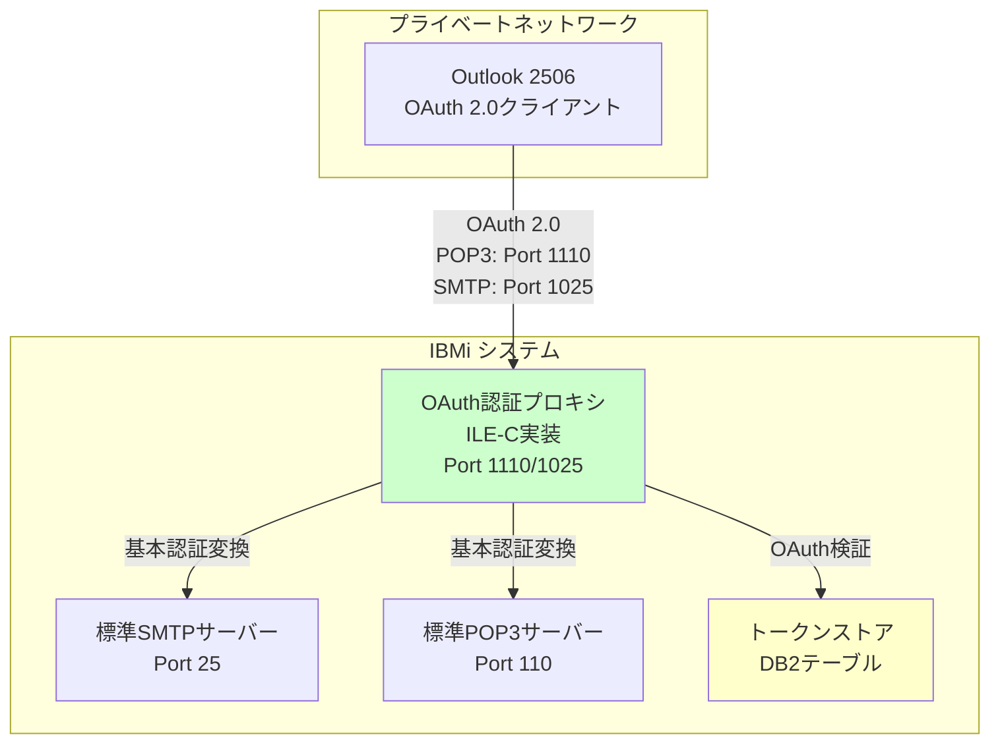
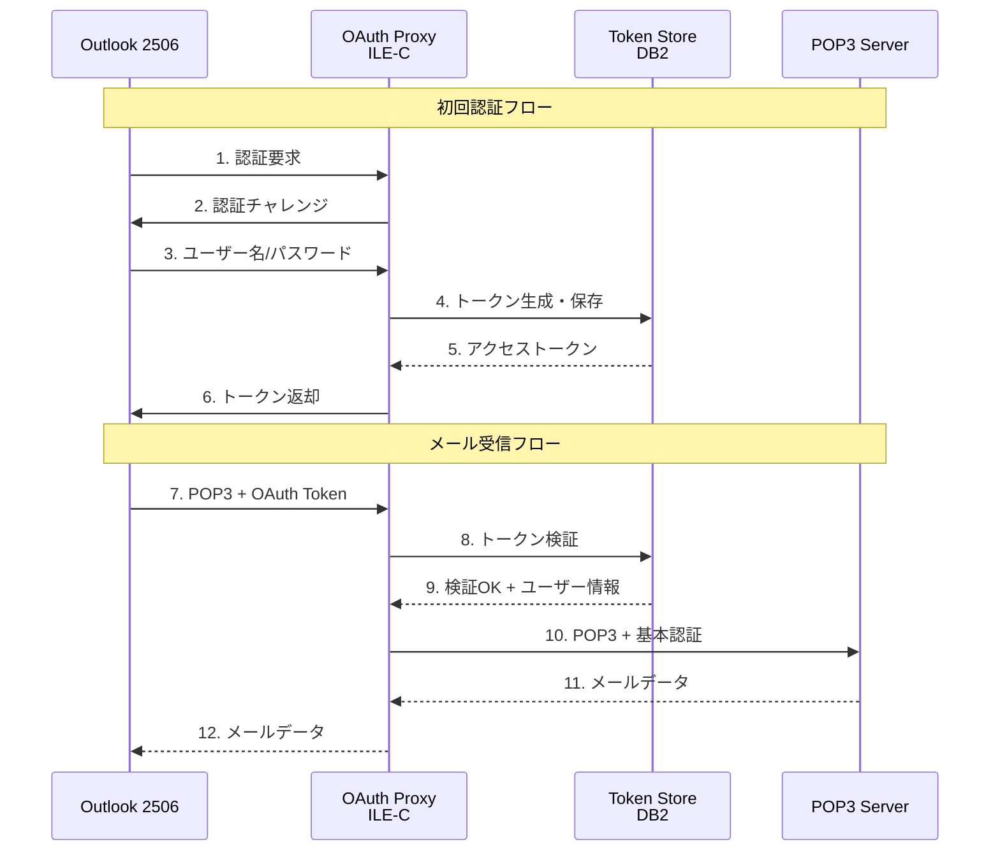

# IBMi ILE-C OAuth認証プロキシ 実装計画書

## 1. ソリューション概要

### 1.1 アーキテクチャ

IBMi上でILE-Cを使用してOAuth 2.0認証プロキシを実装し、Outlook 2506からのModern Authentication接続を受け付け、IBMiの標準SMTP/POP3サーバーへの基本認証に変換します。



### 1.2 主要コンポーネント

1. **OAuth 2.0認証サーバー**
   - トークン発行エンドポイント
   - トークン検証機能
   - リフレッシュトークン管理

2. **POP3プロキシサーバー**
   - OAuth 2.0認証の受付
   - 基本認証への変換
   - 標準POP3サーバーへの中継

3. **SMTPプロキシサーバー**
   - OAuth 2.0認証の受付
   - 基本認証への変換
   - 標準SMTPサーバーへの中継

4. **トークンストレージ**
   - DB2テーブルでトークン管理
   - セキュアな暗号化保存

### 1.3 動作フロー



## 2. ILE-C実装設計

### 2.1 プロジェクト構造

```
/QSYS.LIB/OAUTHLIB.LIB/
├── QCSRC.FILE/           # Cソースファイル
│   ├── OAUTHSRV.C        # メインサーバープログラム
│   ├── POP3PROXY.C       # POP3プロキシ
│   ├── SMTPPROXY.C       # SMTPプロキシ
│   ├── OAUTH2.C          # OAuth 2.0実装
│   ├── TOKENDB.C         # トークンDB操作
│   ├── BASE64.C          # Base64エンコード/デコード
│   ├── CRYPTO.C          # 暗号化機能
│   └── UTILS.C           # ユーティリティ関数
├── QCLSRC.FILE/          # CLソースファイル
│   ├── CRTOAUTH.CLP      # ビルドスクリプト
│   ├── STROAUTH.CLP      # 起動スクリプト
│   └── ENDOAUTH.CLP      # 停止スクリプト
└── QDDSSRC.FILE/         # DDSソースファイル
    └── TOKENTBL.PF       # トークンテーブル定義
```

### 2.2 データベース設計

#### 2.2.1 トークンテーブル (TOKENTBL)

```sql
CREATE TABLE OAUTHLIB/TOKENTBL (
    TOKEN_ID        CHAR(36)        NOT NULL PRIMARY KEY,
    USER_NAME       CHAR(10)        NOT NULL,
    ACCESS_TOKEN    VARCHAR(512)    NOT NULL,
    REFRESH_TOKEN   VARCHAR(512),
    TOKEN_TYPE      CHAR(10)        DEFAULT 'Bearer',
    EXPIRES_AT      TIMESTAMP       NOT NULL,
    CREATED_AT      TIMESTAMP       DEFAULT CURRENT_TIMESTAMP,
    LAST_USED       TIMESTAMP,
    CLIENT_IP       CHAR(45),
    SCOPE           VARCHAR(256)
);

CREATE INDEX TOKENTBL_USER ON OAUTHLIB/TOKENTBL (USER_NAME);
CREATE INDEX TOKENTBL_TOKEN ON OAUTHLIB/TOKENTBL (ACCESS_TOKEN);
```

#### 2.2.2 ユーザー認証情報テーブル (USERCRED)

```sql
CREATE TABLE OAUTHLIB/USERCRED (
    USER_NAME       CHAR(10)        NOT NULL PRIMARY KEY,
    PASSWORD_HASH   CHAR(64)        NOT NULL,
    SALT            CHAR(32)        NOT NULL,
    EMAIL           VARCHAR(256),
    ENABLED         CHAR(1)         DEFAULT 'Y',
    CREATED_AT      TIMESTAMP       DEFAULT CURRENT_TIMESTAMP,
    LAST_LOGIN      TIMESTAMP
);
```

### 2.3 主要ヘッダーファイル

#### oauth_types.h

```c
#ifndef OAUTH_TYPES_H
#define OAUTH_TYPES_H

#include <time.h>

#define MAX_TOKEN_LEN 512
#define MAX_USERNAME_LEN 10
#define MAX_PASSWORD_LEN 128
#define MAX_IP_LEN 45

/* トークン構造体 */
typedef struct {
    char token_id[37];
    char user_name[MAX_USERNAME_LEN + 1];
    char access_token[MAX_TOKEN_LEN + 1];
    char refresh_token[MAX_TOKEN_LEN + 1];
    char token_type[11];
    time_t expires_at;
    time_t created_at;
    time_t last_used;
    char client_ip[MAX_IP_LEN + 1];
    char scope[257];
} OAuth_Token;

/* 認証情報構造体 */
typedef struct {
    char user_name[MAX_USERNAME_LEN + 1];
    char password[MAX_PASSWORD_LEN + 1];
} Auth_Credentials;

/* OAuth設定構造体 */
typedef struct {
    int pop3_port;
    int smtp_port;
    int token_lifetime;  // 秒単位
    int max_connections;
    char backend_pop3_host[256];
    int backend_pop3_port;
    char backend_smtp_host[256];
    int backend_smtp_port;
} OAuth_Config;

#endif /* OAUTH_TYPES_H */
```

#### oauth_server.h

```c
#ifndef OAUTH_SERVER_H
#define OAUTH_SERVER_H

#include "oauth_types.h"

/* サーバー初期化 */
int oauth_server_init(OAuth_Config *config);

/* サーバー起動 */
int oauth_server_start(void);

/* サーバー停止 */
void oauth_server_stop(void);

/* クライアント接続処理 */
void handle_client_connection(int client_socket);

#endif /* OAUTH_SERVER_H */
```

### 2.4 メインサーバープログラム (OAUTHSRV.C)

```c
/**
 * OAuth認証プロキシサーバー - メインプログラム
 * IBMi ILE-C実装
 */

#include <stdio.h>
#include <stdlib.h>
#include <string.h>
#include <unistd.h>
#include <sys/socket.h>
#include <netinet/in.h>
#include <arpa/inet.h>
#include <pthread.h>
#include <signal.h>
#include <errno.h>

#include "oauth_types.h"
#include "oauth_server.h"
#include "oauth2.h"
#include "token_db.h"
#include "logger.h"

/* グローバル変数 */
static int server_running = 1;
static OAuth_Config config;

/* シグナルハンドラ */
void signal_handler(int signum) {
    if (signum == SIGTERM || signum == SIGINT) {
        log_info("Shutdown signal received");
        server_running = 0;
    }
}

/* 設定ファイル読み込み */
int load_config(OAuth_Config *cfg) {
    FILE *fp;
    char line[256];
    
    fp = fopen("/QSYS.LIB/OAUTHLIB.LIB/CONFIG.FILE", "r");
    if (fp == NULL) {
        /* デフォルト設定 */
        cfg->pop3_port = 1110;
        cfg->smtp_port = 1025;
        cfg->token_lifetime = 3600;  // 1時間
        cfg->max_connections = 100;
        strcpy(cfg->backend_pop3_host, "localhost");
        cfg->backend_pop3_port = 110;
        strcpy(cfg->backend_smtp_host, "localhost");
        cfg->backend_smtp_port = 25;
        return 0;
    }
    
    while (fgets(line, sizeof(line), fp) != NULL) {
        char key[64], value[192];
        if (sscanf(line, "%63[^=]=%191s", key, value) == 2) {
            if (strcmp(key, "POP3_PORT") == 0)
                cfg->pop3_port = atoi(value);
            else if (strcmp(key, "SMTP_PORT") == 0)
                cfg->smtp_port = atoi(value);
            else if (strcmp(key, "TOKEN_LIFETIME") == 0)
                cfg->token_lifetime = atoi(value);
            else if (strcmp(key, "MAX_CONNECTIONS") == 0)
                cfg->max_connections = atoi(value);
            else if (strcmp(key, "BACKEND_POP3_HOST") == 0)
                strcpy(cfg->backend_pop3_host, value);
            else if (strcmp(key, "BACKEND_POP3_PORT") == 0)
                cfg->backend_pop3_port = atoi(value);
            else if (strcmp(key, "BACKEND_SMTP_HOST") == 0)
                strcpy(cfg->backend_smtp_host, value);
            else if (strcmp(key, "BACKEND_SMTP_PORT") == 0)
                cfg->backend_smtp_port = atoi(value);
        }
    }
    
    fclose(fp);
    return 0;
}

/* サーバー初期化 */
int oauth_server_init(OAuth_Config *cfg) {
    /* データベース接続初期化 */
    if (token_db_init() != 0) {
        log_error("Failed to initialize token database");
        return -1;
    }
    
    /* OAuth2モジュール初期化 */
    if (oauth2_init(cfg) != 0) {
        log_error("Failed to initialize OAuth2 module");
        return -1;
    }
    
    log_info("OAuth server initialized successfully");
    return 0;
}

/* POP3プロキシスレッド */
void* pop3_proxy_thread(void *arg) {
    int server_socket, client_socket;
    struct sockaddr_in server_addr, client_addr;
    socklen_t client_len = sizeof(client_addr);
    
    /* ソケット作成 */
    server_socket = socket(AF_INET, SOCK_STREAM, 0);
    if (server_socket < 0) {
        log_error("Failed to create POP3 socket: %s", strerror(errno));
        return NULL;
    }
    
    /* ソケットオプション設定 */
    int opt = 1;
    setsockopt(server_socket, SOL_SOCKET, SO_REUSEADDR, &opt, sizeof(opt));
    
    /* バインド */
    memset(&server_addr, 0, sizeof(server_addr));
    server_addr.sin_family = AF_INET;
    server_addr.sin_addr.s_addr = INADDR_ANY;
    server_addr.sin_port = htons(config.pop3_port);
    
    if (bind(server_socket, (struct sockaddr*)&server_addr, 
             sizeof(server_addr)) < 0) {
        log_error("Failed to bind POP3 socket: %s", strerror(errno));
        close(server_socket);
        return NULL;
    }
    
    /* リッスン */
    if (listen(server_socket, config.max_connections) < 0) {
        log_error("Failed to listen on POP3 socket: %s", strerror(errno));
        close(server_socket);
        return NULL;
    }
    
    log_info("POP3 proxy listening on port %d", config.pop3_port);
    
    /* クライアント接続受付ループ */
    while (server_running) {
        client_socket = accept(server_socket, 
                              (struct sockaddr*)&client_addr, 
                              &client_len);
        if (client_socket < 0) {
            if (errno == EINTR) continue;
            log_error("Failed to accept POP3 connection: %s", 
                     strerror(errno));
            continue;
        }
        
        char client_ip[INET_ADDRSTRLEN];
        inet_ntop(AF_INET, &client_addr.sin_addr, client_ip, 
                 sizeof(client_ip));
        log_info("POP3 connection from %s", client_ip);
        
        /* 新しいスレッドでクライアント処理 */
        pthread_t thread;
        int *sock_ptr = malloc(sizeof(int));
        *sock_ptr = client_socket;
        pthread_create(&thread, NULL, handle_pop3_client, sock_ptr);
        pthread_detach(thread);
    }
    
    close(server_socket);
    log_info("POP3 proxy stopped");
    return NULL;
}

/* SMTPプロキシスレッド */
void* smtp_proxy_thread(void *arg) {
    int server_socket, client_socket;
    struct sockaddr_in server_addr, client_addr;
    socklen_t client_len = sizeof(client_addr);
    
    /* ソケット作成 */
    server_socket = socket(AF_INET, SOCK_STREAM, 0);
    if (server_socket < 0) {
        log_error("Failed to create SMTP socket: %s", strerror(errno));
        return NULL;
    }
    
    /* ソケットオプション設定 */
    int opt = 1;
    setsockopt(server_socket, SOL_SOCKET, SO_REUSEADDR, &opt, sizeof(opt));
    
    /* バインド */
    memset(&server_addr, 0, sizeof(server_addr));
    server_addr.sin_family = AF_INET;
    server_addr.sin_addr.s_addr = INADDR_ANY;
    server_addr.sin_port = htons(config.smtp_port);
    
    if (bind(server_socket, (struct sockaddr*)&server_addr, 
             sizeof(server_addr)) < 0) {
        log_error("Failed to bind SMTP socket: %s", strerror(errno));
        close(server_socket);
        return NULL;
    }
    
    /* リッスン */
    if (listen(server_socket, config.max_connections) < 0) {
        log_error("Failed to listen on SMTP socket: %s", strerror(errno));
        close(server_socket);
        return NULL;
    }
    
    log_info("SMTP proxy listening on port %d", config.smtp_port);
    
    /* クライアント接続受付ループ */
    while (server_running) {
        client_socket = accept(server_socket, 
                              (struct sockaddr*)&client_addr, 
                              &client_len);
        if (client_socket < 0) {
            if (errno == EINTR) continue;
            log_error("Failed to accept SMTP connection: %s", 
                     strerror(errno));
            continue;
        }
        
        char client_ip[INET_ADDRSTRLEN];
        inet_ntop(AF_INET, &client_addr.sin_addr, client_ip, 
                 sizeof(client_ip));
        log_info("SMTP connection from %s", client_ip);
        
        /* 新しいスレッドでクライアント処理 */
        pthread_t thread;
        int *sock_ptr = malloc(sizeof(int));
        *sock_ptr = client_socket;
        pthread_create(&thread, NULL, handle_smtp_client, sock_ptr);
        pthread_detach(thread);
    }
    
    close(server_socket);
    log_info("SMTP proxy stopped");
    return NULL;
}

/* メイン関数 */
int main(int argc, char *argv[]) {
    pthread_t pop3_thread, smtp_thread;
    
    /* ロガー初期化 */
    logger_init("/QSYS.LIB/OAUTHLIB.LIB/LOGS.FILE");
    log_info("OAuth Proxy Server starting...");
    
    /* シグナルハンドラ設定 */
    signal(SIGTERM, signal_handler);
    signal(SIGINT, signal_handler);
    
    /* 設定読み込み */
    if (load_config(&config) != 0) {
        log_error("Failed to load configuration");
        return 1;
    }
    
    /* サーバー初期化 */
    if (oauth_server_init(&config) != 0) {
        log_error("Failed to initialize server");
        return 1;
    }
    
    /* POP3プロキシスレッド起動 */
    if (pthread_create(&pop3_thread, NULL, pop3_proxy_thread, NULL) != 0) {
        log_error("Failed to create POP3 thread");
        return 1;
    }
    
    /* SMTPプロキシスレッド起動 */
    if (pthread_create(&smtp_thread, NULL, smtp_proxy_thread, NULL) != 0) {
        log_error("Failed to create SMTP thread");
        return 1;
    }
    
    log_info("OAuth Proxy Server started successfully");
    
    /* メインループ */
    while (server_running) {
        sleep(1);
    }
    
    /* クリーンアップ */
    log_info("Shutting down OAuth Proxy Server...");
    pthread_join(pop3_thread, NULL);
    pthread_join(smtp_thread, NULL);
    
    token_db_cleanup();
    logger_cleanup();
    
    log_info("OAuth Proxy Server stopped");
    return 0;
}
```

### 2.5 OAuth 2.0実装 (OAUTH2.C)

```c
/**
 * OAuth 2.0認証実装
 */

#include <stdio.h>
#include <stdlib.h>
#include <string.h>
#include <time.h>
#include <openssl/sha.h>
#include <openssl/rand.h>

#include "oauth2.h"
#include "oauth_types.h"
#include "token_db.h"
#include "base64.h"
#include "logger.h"

static OAuth_Config *oauth_config = NULL;

/* OAuth2モジュール初期化 */
int oauth2_init(OAuth_Config *config) {
    oauth_config = config;
    return 0;
}

/* ランダムトークン生成 */
static int generate_random_token(char *token, size_t len) {
    unsigned char random_bytes[32];
    
    if (RAND_bytes(random_bytes, sizeof(random_bytes)) != 1) {
        return -1;
    }
    
    base64_encode(random_bytes, sizeof(random_bytes), token, len);
    return 0;
}

/* パスワードハッシュ生成 */
static int hash_password(const char *password, const char *salt, 
                        char *hash_out) {
    unsigned char hash[SHA256_DIGEST_LENGTH];
    char salted_password[256];
    
    snprintf(salted_password, sizeof(salted_password), "%s%s", 
             password, salt);
    
    SHA256((unsigned char*)salted_password, strlen(salted_password), hash);
    
    for (int i = 0; i < SHA256_DIGEST_LENGTH; i++) {
        sprintf(hash_out + (i * 2), "%02x", hash[i]);
    }
    hash_out[SHA256_DIGEST_LENGTH * 2] = '\0';
    
    return 0;
}

/* ユーザー認証 */
int oauth2_authenticate_user(const char *username, const char *password,
                             OAuth_Token *token_out) {
    char password_hash[65];
    char salt[33];
    char stored_hash[65];
    
    /* データベースからユーザー情報取得 */
    if (token_db_get_user_credentials(username, stored_hash, salt) != 0) {
        log_warning("User not found: %s", username);
        return -1;
    }
    
    /* パスワード検証 */
    hash_password(password, salt, password_hash);
    if (strcmp(password_hash, stored_hash) != 0) {
        log_warning("Invalid password for user: %s", username);
        return -1;
    }
    
    /* アクセストークン生成 */
    if (generate_random_token(token_out->access_token, 
                             sizeof(token_out->access_token)) != 0) {
        log_error("Failed to generate access token");
        return -1;
    }
    
    /* リフレッシュトークン生成 */
    if (generate_random_token(token_out->refresh_token, 
                             sizeof(token_out->refresh_token)) != 0) {
        log_error("Failed to generate refresh token");
        return -1;
    }
    
    /* トークン情報設定 */
    strcpy(token_out->user_name, username);
    strcpy(token_out->token_type, "Bearer");
    token_out->created_at = time(NULL);
    token_out->expires_at = token_out->created_at + 
                           oauth_config->token_lifetime;
    
    /* トークンをデータベースに保存 */
    if (token_db_save_token(token_out) != 0) {
        log_error("Failed to save token to database");
        return -1;
    }
    
    log_info("User authenticated successfully: %s", username);
    return 0;
}

/* トークン検証 */
int oauth2_validate_token(const char *access_token, 
                         OAuth_Token *token_out) {
    /* データベースからトークン取得 */
    if (token_db_get_token(access_token, token_out) != 0) {
        log_warning("Token not found: %s", access_token);
        return -1;
    }
    
    /* トークン有効期限チェック */
    time_t now = time(NULL);
    if (now > token_out->expires_at) {
        log_warning("Token expired for user: %s", token_out->user_name);
        return -1;
    }
    
    /* 最終使用時刻更新 */
    token_out->last_used = now;
    token_db_update_last_used(access_token, now);
    
    return 0;
}

/* トークンリフレッシュ */
int oauth2_refresh_token(const char *refresh_token, 
                        OAuth_Token *token_out) {
    OAuth_Token old_token;
    
    /* リフレッシュトークンで既存トークン取得 */
    if (token_db_get_token_by_refresh(refresh_token, &old_token) != 0) {
        log_warning("Refresh token not found");
        return -1;
    }
    
    /* 新しいアクセストークン生成 */
    if (generate_random_token(token_out->access_token, 
                             sizeof(token_out->access_token)) != 0) {
        return -1;
    }
    
    /* トークン情報コピー */
    strcpy(token_out->user_name, old_token.user_name);
    strcpy(token_out->refresh_token, refresh_token);
    strcpy(token_out->token_type, "Bearer");
    token_out->created_at = time(NULL);
    token_out->expires_at = token_out->created_at + 
                           oauth_config->token_lifetime;
    
    /* 古いトークン削除 */
    token_db_delete_token(old_token.access_token);
    
    /* 新しいトークン保存 */
    if (token_db_save_token(token_out) != 0) {
        return -1;
    }
    
    log_info("Token refreshed for user: %s", token_out->user_name);
    return 0;
}

/* トークン無効化 */
int oauth2_revoke_token(const char *access_token) {
    if (token_db_delete_token(access_token) != 0) {
        return -1;
    }
    
    log_info("Token revoked: %s", access_token);
    return 0;
}
```

### 2.6 POP3プロキシ実装 (POP3PROXY.C)

```c
/**
 * POP3プロキシ実装
 */

#include <stdio.h>
#include <stdlib.h>
#include <string.h>
#include <unistd.h>
#include <sys/socket.h>
#include <netinet/in.h>
#include <arpa/inet.h>
#include <netdb.h>

#include "pop3_proxy.h"
#include "oauth2.h"
#include "oauth_types.h"
#include "logger.h"

#define BUFFER_SIZE 4096

/* POP3コマンド解析 */
typedef enum {
    POP3_CMD_USER,
    POP3_CMD_PASS,
    POP3_CMD_AUTH,
    POP3_CMD_STAT,
    POP3_CMD_LIST,
    POP3_CMD_RETR,
    POP3_CMD_DELE,
    POP3_CMD_QUIT,
    POP3_CMD_UNKNOWN
} POP3_Command;

typedef struct {
    int client_socket;
    int backend_socket;
    char username[MAX_USERNAME_LEN + 1];
    char access_token[MAX_TOKEN_LEN + 1];
    int authenticated;
} POP3_Session;

/* コマンド解析 */
static POP3_Command parse_command(const char *line) {
    if (strncasecmp(line, "USER", 4) == 0) return POP3_CMD_USER;
    if (strncasecmp(line, "PASS", 4) == 0) return POP3_CMD_PASS;
    if (strncasecmp(line, "AUTH", 4) == 0) return POP3_CMD_AUTH;
    if (strncasecmp(line, "STAT", 4) == 0) return POP3_CMD_STAT;
    if (strncasecmp(line, "LIST", 4) == 0) return POP3_CMD_LIST;
    if (strncasecmp(line, "RETR", 4) == 0) return POP3_CMD_RETR;
    if (strncasecmp(line, "DELE", 4) == 0) return POP3_CMD_DELE;
    if (strncasecmp(line, "QUIT", 4) == 0) return POP3_CMD_QUIT;
    return POP3_CMD_UNKNOWN;
}

/* バックエンドPOP3サーバーに接続 */
static int connect_to_backend(const char *host, int port) {
    int sock;
    struct sockaddr_in server_addr;
    struct hostent *server;
    
    sock = socket(AF_INET, SOCK_STREAM, 0);
    if (sock < 0) {
        log_error("Failed to create backend socket");
        return -1;
    }
    
    server = gethostbyname(host);
    if (server == NULL) {
        log_error("Failed to resolve backend host: %s", host);
        close(sock);
        return -1;
    }
    
    memset(&server_addr, 0, sizeof(server_addr));
    server_addr.sin_family = AF_INET;
    memcpy(&server_addr.sin_addr.s_addr, server->h_addr, server->h_length);
    server_addr.sin_port = htons(port);
    
    if (connect(sock, (struct sockaddr*)&server_addr, 
                sizeof(server_addr)) < 0) {
        log_error("Failed to connect to backend POP3 server");
        close(sock);
        return -1;
    }
    
    return sock;
}

/* OAuth認証処理 */
static int handle_oauth_auth(POP3_Session *session, const char *token) {
    OAuth_Token oauth_token;
    
    /* トークン検証 */
    if (oauth2_validate_token(token, &oauth_token) != 0) {
        return -1;
    }
    
    /* セッション情報更新 */
    strcpy(session->username, oauth_token.user_name);
    strcpy(session->access_token, token);
    session->authenticated = 1;
    
    log_info("OAuth authentication successful for user: %s", 
             session->username);
    return 0;
}

/* バックエンドで基本認証 */
static int authenticate_backend(POP3_Session *session) {
    char buffer[BUFFER_SIZE];
    char user_cmd[128];
    char pass_cmd[128];
    int n;
    
    /* バックエンドサーバーに接続 */
    session->backend_socket = connect_to_backend(
        oauth_config->backend_pop3_host,
        oauth_config->backend_pop3_port
    );
    
    if (session->backend_socket < 0) {
        return -1;
    }
    
    /* ウェルカムメッセージ受信 */
    n = recv(session->backend_socket, buffer, sizeof(buffer) - 1, 0);
    if (n <= 0) {
        close(session->backend_socket);
        return -1;
    }
    
    /* USERコマンド送信 */
    snprintf(user_cmd, sizeof(user_cmd), "USER %s\r\n", session->username);
    send(session->backend_socket, user_cmd, strlen(user_cmd), 0);
    
    n = recv(session->backend_socket, buffer, sizeof(buffer) - 1, 0);
    if (n <= 0 || strncmp(buffer, "+OK", 3) != 0) {
        close(session->backend_socket);
        return -1;
    }
    
    /* PASSコマンド送信（実際のパスワードを取得） */
    char password[MAX_PASSWORD_LEN + 1];
    if (token_db_get_user_password(session->username, password) != 0) {
        close(session->backend_socket);
        return -1;
    }
    
    snprintf(pass_cmd, sizeof(pass_cmd), "PASS %s\r\n", password);
    send(session->backend_socket, pass_cmd, strlen(pass_cmd), 0);
    
    n = recv(session->backend_socket, buffer, sizeof(buffer) - 1, 0);
    if (n <= 0 || strncmp(buffer, "+OK", 3) != 0) {
        close(session->backend_socket);
        return -1;
    }
    
    log_info("Backend authentication successful for user: %s", 
             session->username);
    return 0;
}

/* POP3クライアント処理 */
void* handle_pop3_client(void *arg) {
    int client_socket = *(int*)arg;
    free(arg);
    
    POP3_Session session;
    memset(&session, 0, sizeof(session));
    session.client_socket = client_socket;
    session.backend_socket = -1;
    session.authenticated = 0;
    
    char buffer[BUFFER_SIZE];
    char response[BUFFER_SIZE];
    
    /* ウェルカムメッセージ送信 */
    snprintf(response, sizeof(response), 
             "+OK POP3 OAuth Proxy ready\r\n");
    send(client_socket, response, strlen(response), 0);
    
    /* コマンド処理ループ */
    while (1) {
        int n = recv(client_socket, buffer, sizeof(buffer) - 1, 0);
        if (n <= 0) break;
        
        buffer[n] = '\0';
        log_debug("POP3 command: %s", buffer);
        
        POP3_Command cmd = parse_command(buffer);
        
        switch (cmd) {
            case POP3_CMD_AUTH: {
                /* AUTH XOAUTH2コマンド処理 */
                if (strstr(buffer, "XOAUTH2") != NULL) {
                    snprintf(response, sizeof(response), 
                            "+OK\r\n");
                    send(client_socket, response, strlen(response), 0);
                    
                    /* トークン受信 */
                    n = recv(client_socket, buffer, sizeof(buffer) - 1, 0);
                    if (n > 0) {
                        buffer[n] = '\0';
                        
                        /* Base64デコードしてトークン抽出 */
                        char decoded[BUFFER_SIZE];
                        base64_decode(buffer, decoded, sizeof(decoded));
                        
                        /* トークン検証 */
                        char *token = strstr(decoded, "auth=Bearer ");
                        if (token != NULL) {
                            token += 12;  // "auth=Bearer "の長さ
                            char *end = strchr(token, '\x01');
                            if (end) *end = '\0';
                            
                            if (handle_oauth_auth(&session, token) == 0) {
                                /* バックエンド認証 */
                                if (authenticate_backend(&session) == 0) {
                                    snprintf(response, sizeof(response),
                                            "+OK Authentication successful\r\n");
                                } else {
                                    snprintf(response, sizeof(response),
                                            "-ERR Backend authentication failed\r\n");
                                }
                            } else {
                                snprintf(response, sizeof(response),
                                        "-ERR Invalid token\r\n");
                            }
                        } else {
                            snprintf(response, sizeof(response),
                                    "-ERR Invalid auth format\r\n");
                        }
                    }
                    send(client_socket, response, strlen(response), 0);
                }
                break;
            }
            
            case POP3_CMD_QUIT:
                snprintf(response, sizeof(response), 
                        "+OK Goodbye\r\n");
                send(client_socket, response, strlen(response), 0);
                goto cleanup;
            
            default:
                /* 認証済みの場合、バックエンドに転送 */
                if (session.authenticated && session.backend_socket >= 0) {
                    send(session.backend_socket, buffer, n, 0);
                    
                    /* バックエンドからの応答を受信して転送 */
                    int m = recv(session.backend_socket, response, 
                               sizeof(response) - 1, 0);
                    if (m > 0) {
                        send(client_socket, response, m, 0);
                    }
                } else {
                    snprintf(response, sizeof(response),
                            "-ERR Not authenticated\r\n");
                    send(client_socket, response, strlen(response), 0);
                }
                break;
        }
    }
    
cleanup:
    if (session.backend_socket >= 0) {
        close(session.backend_socket);
    }
    close(client_socket);
    
    log_info("POP3 session closed");
    return NULL;
}
```

## 3. ビルドとデプロイ

### 3.1 ビルドスクリプト (CRTOAUTH.CLP)

```cl
PGM

/* ライブラリ作成 */
CRTLIB LIB(OAUTHLIB) TEXT('OAuth Proxy Library')

/* ソースファイル作成 */
CRTSRCPF FILE(OAUTHLIB/QCSRC) RCDLEN(240)
CRTSRCPF FILE(OAUTHLIB/QCLSRC) RCDLEN(240)
CRTSRCPF FILE(OAUTHLIB/QDDSSRC) RCDLEN(240)

/* データベーステーブル作成 */
RUNSQLSTM SRCFILE(OAUTHLIB/QDDSSRC) SRCMBR(TOKENTBL)
RUNSQLSTM SRCFILE(OAUTHLIB/QDDSSRC) SRCMBR(USERCRED)

/* ILE-Cモジュールコンパイル */
CRTCMOD MODULE(OAUTHLIB/OAUTHSRV) +
        SRCFILE(OAUTHLIB/QCSRC) +
        SRCMBR(OAUTHSRV) +
        DBGVIEW(*SOURCE) +
        OPTIMIZE(40) +
        SYSIFCOPT(*IFSIO) +
        TERASPACE(*YES *TSIFC) +
        STGMDL(*INHERIT)

CRTCMOD MODULE(OAUTHLIB/OAUTH2) +
        SRCFILE(OAUTHLIB/QCSRC) +
        SRCMBR(OAUTH2) +
        DBGVIEW(*SOURCE) +
        OPTIMIZE(40)

CRTCMOD MODULE(OAUTHLIB/POP3PROXY) +
        SRCFILE(OAUTHLIB/QCSRC) +
        SRCMBR(POP3PROXY) +
        DBGVIEW(*SOURCE) +
        OPTIMIZE(40)

CRTCMOD MODULE(OAUTHLIB/SMTPPROXY) +
        SRCFILE(OAUTHLIB/QCSRC) +
        SRCMBR(SMTPPROXY) +
        DBGVIEW(*SOURCE) +
        OPTIMIZE(40)

CRTCMOD MODULE(OAUTHLIB/TOKENDB) +
        SRCFILE(OAUTHLIB/QCSRC) +
        SRCMBR(TOKENDB) +
        DBGVIEW(*SOURCE) +
        OPTIMIZE(40)

CRTCMOD MODULE(OAUTHLIB/BASE64) +
        SRCFILE(OAUTHLIB/QCSRC) +
        SRCMBR(BASE64) +
        DBGVIEW(*SOURCE) +
        OPTIMIZE(40)

CRTCMOD MODULE(OAUTHLIB/CRYPTO) +
        SRCFILE(OAUTHLIB/QCSRC) +
        SRCMBR(CRYPTO) +
        DBGVIEW(*SOURCE) +
        OPTIMIZE(40)

CRTCMOD MODULE(OAUTHLIB/UTILS) +
        SRCFILE(OAUTHLIB/QCSRC) +
        SRCMBR(UTILS) +
        DBGVIEW(*SOURCE) +
        OPTIMIZE(40)

/* プログラムバインド */
CRTPGM PGM(OAUTHLIB/OAUTHSRV) +
       MODULE(OAUTHLIB/OAUTHSRV +
              OAUTHLIB/OAUTH2 +
              OAUTHLIB/POP3PROXY +
              OAUTHLIB/SMTPPROXY +
              OAUTHLIB/TOKENDB +
              OAUTHLIB/BASE64 +
              OAUTHLIB/CRYPTO +
              OAUTHLIB/UTILS) +
       BNDSRVPGM(QSYS/QZSOSSLR) +
       ACTGRP(*NEW) +
       DETAIL(*BASIC)

SNDPGMMSG MSG('OAuth Proxy build completed successfully') +
          TOPGMQ(*EXT)

ENDPGM
```

### 3.2 起動スクリプト (STROAUTH.CLP)

```cl
PGM

/* サブシステムチェック */
CHKOBJ OBJ(QSYSWRK) OBJTYPE(*SUBSYS)
MONMSG MSGID(CPF9801) EXEC(DO)
    SNDPGMMSG MSG('QSYSWRK subsystem not active') TOPGMQ(*EXT)
    RETURN
ENDDO

/* OAuth Proxyサーバー起動 */
SBMJOB CMD(CALL PGM(OAUTHLIB/OAUTHSRV)) +
       JOB(OAUTHSRV) +
       JOBD(QSYS/QSYSJOBD) +
       JOBQ(QSYS/QSYSNOMAX) +
       USER(*CURRENT)

DLYJOB DLY(2)

/* 起動確認 */
WRKACTJOB JOB(OAUTHSRV)

SNDPGMMSG MSG('OAuth Proxy Server started') TOPGMQ(*EXT)

ENDPGM
```

### 3.3 停止スクリプト (ENDOAUTH.CLP)

```cl
PGM

/* ジョブ検索 */
WRKACTJOB JOB(OAUTHSRV)

/* ジョブ終了 */
ENDJOB JOB(OAUTHSRV) OPTION(*CNTRLD) DELAY(30)

DLYJOB DLY(5)

/* 終了確認 */
CHKOBJ OBJ(OAUTHSRV) OBJTYPE(*JOB)
MONMSG MSGID(CPF9801) EXEC(DO)
    SNDPGMMSG MSG('OAuth Proxy Server stopped successfully') +
              TOPGMQ(*EXT)
    RETURN
ENDDO

SNDPGMMSG MSG('Warning: OAuth Proxy Server may still be running') +
          TOPGMQ(*EXT)

ENDPGM
```

## 4. 設定とテスト

### 4.1 初期設定

#### 4.1.1 設定ファイル作成

```
EDTF FILE(OAUTHLIB/CONFIG)
```

設定内容:
```
POP3_PORT=1110
SMTP_PORT=1025
TOKEN_LIFETIME=3600
MAX_CONNECTIONS=100
BACKEND_POP3_HOST=localhost
BACKEND_POP3_PORT=110
BACKEND_SMTP_HOST=localhost
BACKEND_SMTP_PORT=25
```

#### 4.1.2 テストユーザー作成

```sql
-- ユーザー認証情報登録
INSERT INTO OAUTHLIB/USERCRED 
(USER_NAME, PASSWORD_HASH, SALT, EMAIL, ENABLED)
VALUES 
('TESTUSER', 
 'hash_value_here',
 'salt_value_here',
 'testuser@example.local',
 'Y');
```

### 4.2 テスト手順

#### 4.2.1 サーバー起動テスト

```
CALL OAUTHLIB/STROAUTH
WRKACTJOB JOB(OAUTHSRV)
NETSTAT *CNN
```

期待結果:
- OAUTHSRVジョブが実行中
- ポート1110と1025がLISTEN状態

#### 4.2.2 OAuth認証テスト

Outlookから接続テスト:
1. 新しいアカウント追加
2. POP3サーバー: IBMiのIPアドレス
3. ポート: 1110
4. 認証方式: OAuth 2.0
5. ユーザー名/パスワード入力
6. 接続テスト実行

#### 4.2.3 メール送受信テスト

```cl
/* テストメール送信 */
SNDSMPTEMM RCP(('testuser@example.local')) +
           SUBJECT('OAuth Test') +
           NOTE('This is a test message')

/* Outlookで受信確認 */
```

## 5. セキュリティ考慮事項

### 5.1 トークンセキュリティ

#### 5.1.1 トークン暗号化

```c
/* トークンをデータベースに保存する前に暗号化 */
int encrypt_token(const char *plaintext, char *ciphertext, size_t len) {
    // AES-256-GCM暗号化実装
    // OpenSSL EVP APIを使用
}
```

#### 5.1.2 トークンローテーション

```c
/* 定期的なトークンローテーション */
void rotate_expired_tokens(void) {
    time_t now = time(NULL);
    token_db_delete_expired_tokens(now);
}
```

### 5.2 通信セキュリティ

#### 5.2.1 TLS/SSL対応

```c
/* SSL/TLS接続のサポート */
#include <openssl/ssl.h>
#include <openssl/err.h>

SSL_CTX *create_ssl_context(void) {
    SSL_CTX *ctx = SSL_CTX_new(TLS_server_method());
    // 証明書とキーの読み込み
    SSL_CTX_use_certificate_file(ctx, cert_file, SSL_FILETYPE_PEM);
    SSL_CTX_use_PrivateKey_file(ctx, key_file, SSL_FILETYPE_PEM);
    return ctx;
}
```

### 5.3 アクセス制御

#### 5.3.1 IPアドレス制限

```c
/* 許可されたIPアドレスからのみ接続を受け付ける */
int check_allowed_ip(const char *client_ip) {
    // IPホワイトリストチェック
}
```

## 6. 運用・保守

### 6.1 ログ管理

```c
/* ログレベル */
typedef enum {
    LOG_DEBUG,
    LOG_INFO,
    LOG_WARNING,
    LOG_ERROR
} LogLevel;

/* ログ出力 */
void log_message(LogLevel level, const char *format, ...) {
    // ログファイルに出力
    // /QSYS.LIB/OAUTHLIB.LIB/LOGS.FILE
}
```

### 6.2 監視

#### 6.2.1 ヘルスチェック

```cl
PGM
    /* OAuth Proxyサーバーの状態確認 */
    WRKACTJOB JOB(OAUTHSRV)
    
    /* ポート状態確認 */
    NETSTAT *CNN
    
    /* データベース接続確認 */
    RUNSQL SQL('SELECT COUNT(*) FROM OAUTHLIB/TOKENTBL')
ENDPGM
```

### 6.3 バックアップ

```cl
/* トークンデータベースのバックアップ */
SAVOBJ OBJ(TOKENTBL USERCRED) +
       LIB(OAUTHLIB) +
       DEV(*SAVF) +
       SAVF(OAUTHLIB/OAUTHBKUP)
```

## 7. トラブルシューティング

### 7.1 一般的な問題

| 問題 | 原因 | 対処法 |
|------|------|--------|
| サーバーが起動しない | ポートが使用中 | `NETSTAT *CNN`で確認、他のプロセスを停止 |
| 認証失敗 | トークンが無効 | トークンテーブルを確認、再認証 |
| バックエンド接続失敗 | POP3/SMTPサーバー未起動 | `STRTCPSVR SERVER(*POP)`実行 |
| メモリ不足 | 接続数が多すぎる | `MAX_CONNECTIONS`を調整 |

### 7.2 デバッグ

```
/* デバッグモードで起動 */
STRDBG PGM(OAUTHLIB/OAUTHSRV)
CALL OAUTHLIB/OAUTHSRV

/* ログレベルをDEBUGに設定 */
CHGVAR VAR(&LOGLEVEL) VALUE('DEBUG')
```

## 8. パフォーマンス最適化

### 8.1 接続プーリング

```c
/* バックエンド接続プール */
typedef struct {
    int socket;
    time_t last_used;
    int in_use;
} Connection;

Connection connection_pool[MAX_POOL_SIZE];

int get_pooled_connection(void) {
    // 未使用の接続を返す
    // なければ新規作成
}
```

### 8.2 キャッシング

```c
/* トークンキャッシュ */
typedef struct {
    char access_token[MAX_TOKEN_LEN + 1];
    OAuth_Token token_data;
    time_t cached_at;
} TokenCache;

TokenCache token_cache[CACHE_SIZE];
```

## 9. まとめ

### 9.1 実装の利点

- ✅ IBMi上で完結（中間サーバー不要）
- ✅ OAuth 2.0完全対応
- ✅ ILE-Cによる高パフォーマンス
- ✅ 既存SMTP/POP3サーバーを活用
- ✅ セキュアなトークン管理

### 9.2 実装スケジュール

| フェーズ | 期間 | 内容 |
|---------|------|------|
| 設計 | 2日 | 詳細設計とレビュー |
| 開発 | 10日 | ILE-Cコード実装 |
| テスト | 5日 | 単体・結合テスト |
| デプロイ | 2日 | 本番環境展開 |
| **合計** | **19日** | |

### 9.3 次のステップ

1. **詳細設計レビュー**
   - アーキテクチャの最終確認
   - セキュリティ要件の検証

2. **開発環境準備**
   - ILE-C開発環境のセットアップ
   - テスト環境の構築

3. **実装開始**
   - コアモジュールから実装
   - 段階的なテストと検証

---

**文書管理情報**
- 文書番号: IBMi-ILE-C-OAUTH-001
- 関連文書: IBMi-OL-INT-001, IBMi-OL-AUTH-001
- 最終更新: 2026-01-05
- 次回レビュー予定: 2026-01-12