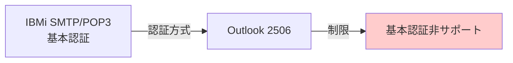
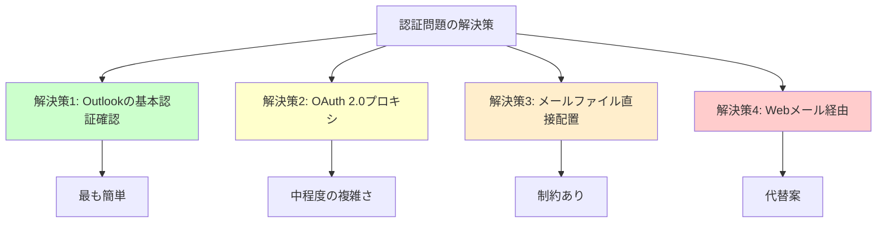
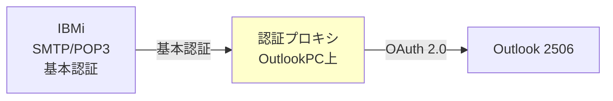
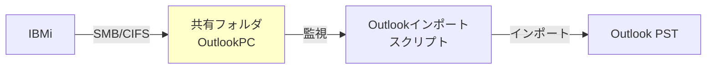
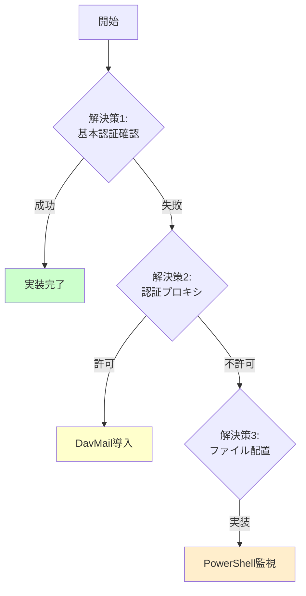
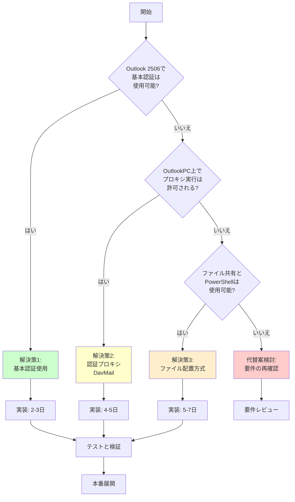

# IBMi-Outlook統合: Microsoft認証方式変更への対応策

## 1. 問題の概要

### 1.1 Microsoft認証方式の変更

Microsoftは2022年10月以降、基本認証（Basic Authentication）のサポートを段階的に廃止し、Modern Authentication（OAuth 2.0）への移行を進めています。

**影響を受けるプロトコル:**
- SMTP AUTH
- POP3
- IMAP4
- Exchange Web Services (EWS)
- Remote PowerShell

**Outlook 2506での状況:**
- Microsoft 365アカウント: Modern Authentication必須
- サードパーティPOP3/IMAP: 基本認証が制限される可能性

### 1.2 当初の計画における課題



**問題点:**
1. IBMiの標準SMTP/POP3は基本認証のみサポート
2. Outlook 2506が基本認証を制限する可能性
3. OAuth 2.0をIBMiで実装するのは困難

## 2. 解決策の分析

### 2.1 認証スコープの明確化

**重要な区別:**

| 接続先 | 認証方式 | 影響 |
|--------|---------|------|
| Microsoft 365サーバー | Modern Authentication必須 | ✅ 既存アカウントは問題なし |
| ローカルPOP3サーバー（IBMi） | サーバー側で決定 | ⚠️ Outlookの制限を確認必要 |

**Outlook 2506の動作:**
- Microsoft以外のPOP3/IMAPサーバーへの接続時の認証方式は、サーバー側の設定に依存
- ただし、Outlookのポリシー設定で基本認証が完全にブロックされる可能性あり

### 2.2 解決策の優先順位



## 3. 解決策1: Outlookの基本認証設定確認（推奨）

### 3.1 概要

Outlook 2506でローカルPOP3サーバーへの基本認証が許可されているか確認し、必要に応じてポリシー設定を調整します。

### 3.2 実装手順

#### 3.2.1 Outlookの認証設定確認

**レジストリ設定の確認:**
```
HKEY_CURRENT_USER\Software\Microsoft\Office\16.0\Outlook\RPC
```

**グループポリシーの確認:**
```
コンピューターの構成 > 管理用テンプレート > Microsoft Outlook 2016 > アカウント設定 > Exchange
```

#### 3.2.2 基本認証の有効化（必要な場合）

**方法1: レジストリ編集**
```reg
Windows Registry Editor Version 5.00

[HKEY_CURRENT_USER\Software\Microsoft\Office\16.0\Outlook\Options\Mail]
"EnableBasicAuthForNonMicrosoft"=dword:00000001
```

**方法2: グループポリシー**
```
1. gpedit.msc を実行
2. ユーザーの構成 > 管理用テンプレート > Microsoft Outlook 2016
3. "非Microsoftサーバーへの基本認証を許可" を有効化
```

#### 3.2.3 検証手順

1. Outlookを再起動
2. 新しいアカウントを追加
3. POP3設定でIBMiサーバーを指定
4. 接続テストを実行

**成功基準:**
- 認証エラーが発生しない
- メールの送受信が正常に動作

### 3.3 メリット・デメリット

**メリット:**
- ✅ 既存のIBMi設定をそのまま使用可能
- ✅ 追加のソフトウェア不要
- ✅ 実装が最も簡単

**デメリット:**
- ⚠️ 組織のセキュリティポリシーで制限される可能性
- ⚠️ 将来的にMicrosoftが完全に廃止する可能性

## 4. 解決策2: OAuth 2.0認証プロキシの導入

### 4.1 概要

IBMiとOutlookの間に軽量な認証プロキシを配置し、基本認証をOAuth 2.0に変換します。

**注意:** この解決策は「中間に物理サーバーを置かない」という制約に抵触する可能性があります。ただし、OutlookクライアントPC上で動作するローカルプロセスとして実装すれば、制約を回避できます。

### 4.2 アーキテクチャ



### 4.3 実装オプション

#### オプション1: DavMail（推奨）

**特徴:**
- オープンソースのPOP3/IMAP/SMTPゲートウェイ
- OutlookクライアントPC上で動作
- 基本認証とOAuth 2.0の変換をサポート

**インストール手順:**

1. **DavMailのダウンロード**
   ```
   https://davmail.sourceforge.net/
   ```

2. **設定ファイル（davmail.properties）**
   ```properties
   # IBMi接続設定
   davmail.mode=O365Modern
   davmail.url=http://192.168.1.xxx:110
   davmail.popPort=1110
   davmail.smtpPort=1025
   
   # 認証設定
   davmail.server=true
   davmail.enableProxy=false
   ```

3. **Outlook設定**
   - POP3サーバー: localhost:1110
   - SMTPサーバー: localhost:1025
   - 認証: OAuth 2.0（DavMailが処理）

#### オプション2: カスタムNode.jsプロキシ

**実装例:**

```javascript
// auth-proxy.js
const net = require('net');
const tls = require('tls');

const IBMI_HOST = '192.168.1.xxx';
const IBMI_POP3_PORT = 110;
const LOCAL_PORT = 1110;

const server = net.createServer((clientSocket) => {
  console.log('Client connected');
  
  const ibmiSocket = net.connect({
    host: IBMI_HOST,
    port: IBMI_POP3_PORT
  }, () => {
    console.log('Connected to IBMi');
  });
  
  // 双方向データ転送
  clientSocket.pipe(ibmiSocket);
  ibmiSocket.pipe(clientSocket);
  
  clientSocket.on('error', (err) => {
    console.error('Client error:', err);
    ibmiSocket.end();
  });
  
  ibmiSocket.on('error', (err) => {
    console.error('IBMi error:', err);
    clientSocket.end();
  });
});

server.listen(LOCAL_PORT, 'localhost', () => {
  console.log(`Proxy listening on localhost:${LOCAL_PORT}`);
});
```

**起動:**
```bash
node auth-proxy.js
```

### 4.4 メリット・デメリット

**メリット:**
- ✅ Modern Authenticationに完全対応
- ✅ 将来的な互換性が高い
- ✅ セキュリティポリシーに準拠

**デメリット:**
- ⚠️ OutlookPC上で追加プロセスが必要
- ⚠️ 設定と保守が複雑
- ⚠️ プロキシの障害点が増える

## 5. 解決策3: メールファイル直接配置方式

### 5.1 概要

POP3プロトコルを使用せず、IBMiからOutlookのローカルストレージに直接メールファイルを配置します。

### 5.2 アーキテクチャ



### 5.3 実装手順

#### 5.3.1 共有フォルダの設定

**OutlookPC側:**
```powershell
# 共有フォルダ作成
New-Item -Path "C:\IBMiMail" -ItemType Directory
New-SmbShare -Name "IBMiMail" -Path "C:\IBMiMail" -FullAccess "Everyone"
```

#### 5.3.2 IBMi側のメール送信スクリプト

```cl
PGM
    DCL VAR(&MAILTO) TYPE(*CHAR) LEN(256)
    DCL VAR(&SUBJECT) TYPE(*CHAR) LEN(256)
    DCL VAR(&BODY) TYPE(*CHAR) LEN(1000)
    DCL VAR(&EMLFILE) TYPE(*CHAR) LEN(256)
    DCL VAR(&TIMESTAMP) TYPE(*CHAR) LEN(14)
    
    /* タイムスタンプ生成 */
    RTVSYSVAL SYSVAL(QDATETIME) RTNVAR(&TIMESTAMP)
    
    /* EMLファイル名生成 */
    CHGVAR VAR(&EMLFILE) VALUE('/QNTC/OUTLOOKPC/IBMiMail/' *CAT +
                                &TIMESTAMP *CAT '.eml')
    
    /* EMLファイル作成 */
    CALL PGM(CREATEEML) PARM(&EMLFILE &MAILTO &SUBJECT &BODY)
    
ENDPGM
```

#### 5.3.3 Outlook自動インポートスクリプト

**PowerShellスクリプト（outlook-import.ps1）:**
```powershell
# Outlook COM オブジェクト
$outlook = New-Object -ComObject Outlook.Application
$namespace = $outlook.GetNamespace("MAPI")
$inbox = $namespace.GetDefaultFolder(6) # 受信トレイ

# 監視フォルダ
$watchFolder = "C:\IBMiMail"

# ファイル監視
$watcher = New-Object System.IO.FileSystemWatcher
$watcher.Path = $watchFolder
$watcher.Filter = "*.eml"
$watcher.EnableRaisingEvents = $true

# イベントハンドラ
$action = {
    $path = $Event.SourceEventArgs.FullPath
    Start-Sleep -Seconds 1 # ファイル書き込み完了待ち
    
    try {
        # EMLファイルをOutlookにインポート
        $mailItem = $namespace.OpenSharedItem($path)
        $mailItem.Move($inbox)
        
        # 処理済みファイル削除
        Remove-Item $path -Force
        
        Write-Host "Imported: $path"
    }
    catch {
        Write-Host "Error importing $path : $_"
    }
}

Register-ObjectEvent -InputObject $watcher -EventName Created -Action $action

Write-Host "Watching for new mail files in $watchFolder"
Write-Host "Press Ctrl+C to stop"

# 無限ループ
while ($true) {
    Start-Sleep -Seconds 1
}
```

**タスクスケジューラで自動起動:**
```powershell
$action = New-ScheduledTaskAction -Execute "PowerShell.exe" `
    -Argument "-ExecutionPolicy Bypass -File C:\Scripts\outlook-import.ps1"
$trigger = New-ScheduledTaskTrigger -AtLogOn
$principal = New-ScheduledTaskPrincipal -UserId $env:USERNAME -LogonType Interactive
Register-ScheduledTask -TaskName "OutlookMailImport" `
    -Action $action -Trigger $trigger -Principal $principal
```

### 5.4 メリット・デメリット

**メリット:**
- ✅ 認証問題を完全に回避
- ✅ POP3/SMTPプロトコル不要
- ✅ シンプルなファイルベース

**デメリット:**
- ⚠️ リアルタイム性が低い（ポーリング間隔に依存）
- ⚠️ ファイル共有の設定が必要
- ⚠️ Outlookが起動していないとインポート不可
- ⚠️ EMLファイル形式の正確な生成が必要

## 6. 解決策4: Webメール経由の統合

### 6.1 概要

IBMiからWebメールインターフェースにメールを送信し、OutlookでWebメール経由で受信します。

**注意:** この方法は「IBMiが外部に出ることは許可されていない」という制約に抵触する可能性があります。

### 6.2 実装オプション

#### オプション1: ローカルWebメールサーバー

**Roundcube on Windows:**
```
1. XAMPP（Apache + PHP + MySQL）をインストール
2. Roundcubeをインストール
3. IBMiのPOP3/SMTPに接続
4. OutlookからWebメールにアクセス
```

**制約:**
- Outlookからブラウザ経由でのアクセスになる
- 「Outlookのみ許可」という制約に抵触

### 6.3 メリット・デメリット

**メリット:**
- ✅ 認証問題を回避
- ✅ Webベースで柔軟

**デメリット:**
- ❌ Outlookクライアントを使用しない
- ❌ 制約条件に違反
- ⚠️ 追加のWebサーバーが必要

## 7. 推奨ソリューション

### 7.1 段階的アプローチ



### 7.2 推奨実装順序

**フェーズ1: 検証（1日）**
1. Outlook 2506で基本認証が使用可能か確認
2. テスト環境でPOP3接続を試行
3. 結果に基づいて次のフェーズを決定

**フェーズ2A: 基本認証が使用可能な場合（2日）**
1. 元の計画通りに実装
2. セキュリティポリシーの文書化
3. 定期的な動作確認

**フェーズ2B: 基本認証が使用不可の場合（5日）**
1. DavMailの導入と設定
2. OutlookPC上でのプロキシ起動
3. 統合テストと検証

**フェーズ2C: プロキシも不可の場合（7日）**
1. ファイル配置方式の実装
2. PowerShell監視スクリプトの作成
3. タスクスケジューラ設定

## 8. セキュリティ強化策

### 8.1 基本認証を使用する場合の対策

#### 8.1.1 強力なパスワードポリシー

```
CHGUSRPRF USRPRF(MAILUSER)
          PWDMINLEN(12)
          PWDMIXCASE(*YES)
          PWDRQDDGT(*YES)
          PWDRQDSPC(*YES)
          PWDEXPITV(30)
```

#### 8.1.2 IPアドレス制限

```
ADDTCPF INTNETADR('192.168.1.100') 
        PROTOCOL(*TCP)
        PORT(110)
        ACTION(*ALLOW)

ADDTCPF INTNETADR('*') 
        PROTOCOL(*TCP)
        PORT(110)
        ACTION(*REJECT)
```

#### 8.1.3 接続ログの監視

```cl
PGM
    /* POP3接続ログの監視 */
    DSPLOG PERIOD((*CURRENT))
    
    /* 異常なアクセスパターンの検出 */
    WRKACTJOB SBS(QSYSWRK) JOB(QTCP*)
ENDPGM
```

### 8.2 認証プロキシを使用する場合の対策

#### 8.2.1 プロキシのアクセス制限

```javascript
// auth-proxy.js に追加
const ALLOWED_IPS = ['127.0.0.1', '::1'];

server.on('connection', (socket) => {
  const clientIP = socket.remoteAddress;
  if (!ALLOWED_IPS.includes(clientIP)) {
    console.log(`Rejected connection from ${clientIP}`);
    socket.destroy();
  }
});
```

#### 8.2.2 プロキシの監視

```powershell
# プロキシ監視スクリプト
$processName = "node"
$scriptPath = "C:\Scripts\auth-proxy.js"

while ($true) {
    $process = Get-Process -Name $processName -ErrorAction SilentlyContinue | 
               Where-Object { $_.CommandLine -like "*$scriptPath*" }
    
    if (-not $process) {
        Write-Host "Proxy not running. Starting..."
        Start-Process -FilePath "node" -ArgumentList $scriptPath
    }
    
    Start-Sleep -Seconds 60
}
```

## 9. テスト計画（認証対応版）

### 9.1 認証テストケース

| テストID | テスト内容 | 期待結果 |
|---------|-----------|---------|
| AUTH-01 | Outlook基本認証テスト | 接続成功 or エラーメッセージ確認 |
| AUTH-02 | DavMail経由接続テスト | OAuth 2.0認証成功 |
| AUTH-03 | ファイル配置方式テスト | メール自動インポート成功 |
| AUTH-04 | 不正認証試行テスト | アクセス拒否確認 |
| AUTH-05 | 認証タイムアウトテスト | 適切なエラー処理確認 |

### 9.2 互換性テスト

**Outlookバージョン別テスト:**
- Outlook 2506（現行）
- Outlook 2024
- Outlook for Microsoft 365

**認証方式別テスト:**
- 基本認証（可能な場合）
- OAuth 2.0（プロキシ経由）
- ファイルベース（認証なし）

## 10. トラブルシューティング（認証関連）

### 10.1 基本認証エラー

**エラーメッセージ:**
```
"サーバーは基本認証をサポートしていません"
"Modern Authenticationが必要です"
```

**対処法:**
1. レジストリ設定を確認
2. グループポリシーを確認
3. 解決策2（認証プロキシ）に移行

### 10.2 OAuth 2.0エラー

**エラーメッセージ:**
```
"認証トークンの取得に失敗しました"
"OAuth 2.0エンドポイントに接続できません"
```

**対処法:**
1. DavMail設定を確認
2. プロキシプロセスが起動しているか確認
3. ファイアウォール設定を確認

### 10.3 ファイル配置エラー

**エラーメッセージ:**
```
"ファイルにアクセスできません"
"EMLファイルの形式が正しくありません"
```

**対処法:**
1. 共有フォルダのアクセス権を確認
2. EMLファイルの形式を検証
3. PowerShellスクリプトのログを確認

## 11. 実装決定フローチャート



## 12. まとめと推奨事項

### 12.1 最優先アクション

1. **即座に実施:**
   - Outlook 2506での基本認証サポート状況を確認
   - テスト環境でPOP3接続を試行

2. **結果に基づく判断:**
   - 基本認証が使用可能 → 元の計画を実行
   - 基本認証が不可 → DavMailの導入を検討
   - 両方不可 → ファイル配置方式を実装

### 12.2 長期的な推奨事項

1. **認証方式の監視:**
   - Microsoftの認証ポリシー変更を定期的に確認
   - Outlookのアップデートによる影響を評価

2. **代替案の準備:**
   - 複数の解決策を並行して準備
   - 障害時の切り替え手順を文書化

3. **セキュリティの強化:**
   - 使用する認証方式に関わらず、多層防御を実装
   - 定期的なセキュリティ監査を実施

### 12.3 次のステップ

1. **検証フェーズ（1日）:**
   - Outlook 2506の認証テスト
   - 結果の文書化

2. **実装フェーズ（2-7日）:**
   - 選択した解決策の実装
   - 統合テスト

3. **本番移行（1日）:**
   - 本番環境への展開
   - 運用開始

---

**文書管理情報**
- 文書番号: IBMi-OL-AUTH-001
- 関連文書: IBMi-OL-INT-001
- 最終更新: 2026-01-05
- 次回レビュー予定: 2026-02-05