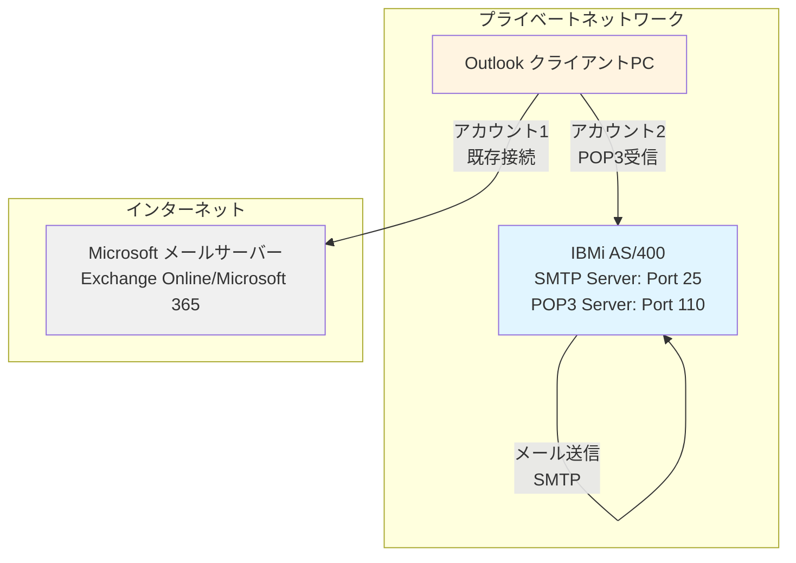
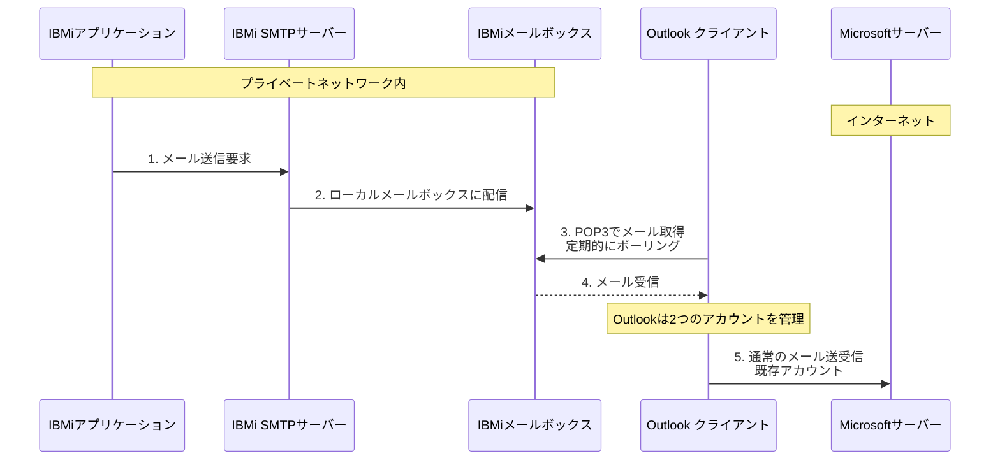
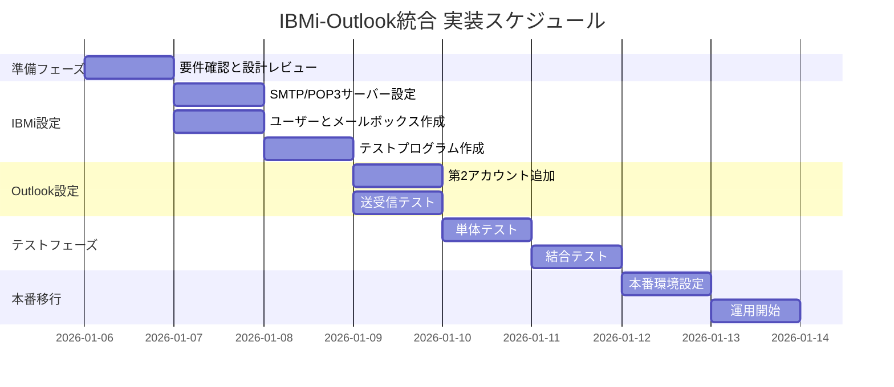
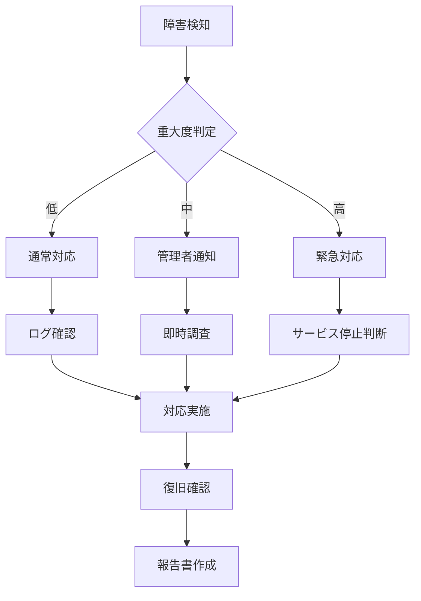

# IBMi-Outlook プライベートネットワーク接続 実装計画書

## 1. 解決策の概要

### 1.1 アーキテクチャ概要

IBMiの標準SMTP/POP3機能を活用し、Outlookに第2メールアカウントを追加することで、制約条件を全て満たす解決策を実現します。

**制約条件の充足状況:**
- ✅ 中間に物理サーバーを置かない（IBMi標準機能を使用）
- ✅ メールクライアントはOutlookのみ（Outlookに第2アカウント追加）
- ✅ OutlookのMicrosoft接続を維持（既存アカウントはそのまま）
- ✅ IBMiは閉じたネットワーク内に留まる（外部接続不要）
- ✅ IBMiはMicrosoftサーバーに接続しない（ローカル完結）

### 1.2 システム構成図



### 1.3 動作フロー



## 2. IBMi側の設定計画

### 2.1 前提条件の確認

```
- IBMi OS バージョン: V7R1以降推奨
- TCP/IP設定が完了していること
- 必要な権限: *ALLOBJ または *IOSYSCFG
```

### 2.2 SMTPサーバーの設定手順

#### 2.2.1 SMTPサーバーの起動設定

```
STRTCPSVR SERVER(*SMTP)
```

#### 2.2.2 SMTP設定の確認・変更

```
CHGSMTPA
```

**推奨設定項目:**
- AUTOSTART: *YES（自動起動）
- MSGLIMIT: 10240（メッセージサイズ上限 10MB）
- INACTTIMO: 600（非アクティブタイムアウト 10分）
- ALWPOPRCV: *YES（POP3受信許可）

#### 2.2.3 SMTPルーティングの設定

ローカル配信のみを許可する設定:

```
ADDSMTPLE INTNETADR('*') 
          NEXTHOP(*REJECT)
          SECURE(*NONE)
```

ローカルドメイン宛のメールを許可:

```
ADDSMTPLE INTNETADR('*@yourdomain.local') 
          NEXTHOP(*DELIVER)
          SECURE(*NONE)
```

### 2.3 POP3サーバーの設定手順

#### 2.3.1 POP3サーバーの起動

```
STRTCPSVR SERVER(*POP)
```

#### 2.3.2 POP3設定の確認

```
WRKTCPSTS *CNN
NETSTAT *CNN
```

ポート110がLISTEN状態であることを確認

### 2.4 ユーザーメールボックスの設定

#### 2.4.1 メールボックス用ユーザープロファイルの作成

```
CRTUSRPRF USRPRF(MAILUSER) 
          PASSWORD(初期パスワード)
          USRCLS(*USER)
          TEXT('Outlook連携用メールボックス')
```

#### 2.4.2 メールボックスディレクトリの確認

```
WRKLNK OBJ('/QIBM/UserData/OS400/SMTP/*')
```

### 2.5 テスト用メール送信プログラム例

#### 2.5.1 CLプログラム例

```cl
PGM
    DCL VAR(&MAILTO) TYPE(*CHAR) LEN(256) +
        VALUE('mailuser@yourdomain.local')
    DCL VAR(&SUBJECT) TYPE(*CHAR) LEN(256) +
        VALUE('IBMiテストメール')
    DCL VAR(&BODY) TYPE(*CHAR) LEN(1000) +
        VALUE('これはIBMiからのテストメッセージです。')
    
    /* SNDSMTPEMMコマンドでメール送信 */
    SNDSMPTEMM RCP((&MAILTO)) +
               SUBJECT(&SUBJECT) +
               NOTE(&BODY) +
               IMPORTANCE(*NORMAL)
               
    SNDPGMMSG MSG('メール送信完了') TOPGMQ(*EXT)
ENDPGM
```

#### 2.5.2 RPGプログラム例

```rpg
**FREE
Ctl-Opt DftActGrp(*No);

Dcl-Pr QtmmSendMail ExtProc('QtmmSendMail');
  *N Pointer Const;
  *N Pointer;
End-Pr;

Dcl-S mailData Char(1000);
Dcl-S errorCode Char(100);

mailData = 'To: mailuser@yourdomain.local' + x'0D25' +
           'Subject: IBMi Test Mail' + x'0D25' +
           x'0D25' +
           'This is a test message from IBMi.';

QtmmSendMail(%Addr(mailData):%Addr(errorCode));

*InLr = *On;
```

### 2.6 セキュリティ設定

#### 2.6.1 ファイアウォール設定（該当する場合）

```
ADDTCPRTE INTNETADR('192.168.1.0') 
          SUBNETMASK('255.255.255.0')
          NEXTHOP(*DFTROUTE)
```

#### 2.6.2 アクセス制限

特定IPアドレスからのみPOP3アクセスを許可:

```
ADDTCPF INTNETADR('192.168.1.100') 
        PROTOCOL(*TCP)
        PORT(110)
        ACTION(*ALLOW)
```

## 3. Outlook側の設定計画

### 3.1 前提条件

- Outlook Version 2506以降
- プライベートネットワーク経由でIBMiにアクセス可能
- 管理者権限（アカウント追加のため）

### 3.2 第2メールアカウントの追加手順

#### 3.2.1 アカウント追加ウィザードの起動

1. Outlookを起動
2. **ファイル** → **アカウントの追加** を選択
3. **詳細オプション** → **自分で自分のアカウントを手動で設定** にチェック
4. **接続** をクリック

#### 3.2.2 POP3アカウントの設定

**アカウント情報:**
- アカウントの種類: **POP**
- メールアドレス: `mailuser@yourdomain.local`
- パスワード: IBMiで設定したユーザーパスワード

**受信メールサーバー設定:**
- サーバー: `192.168.1.xxx`（IBMiのIPアドレス）
- ポート: `110`
- 暗号化方法: **なし**（プライベートネットワーク内のため）
- セキュリティで保護されたパスワード認証（SPA）: **オフ**

**送信メールサーバー設定:**
- サーバー: `192.168.1.xxx`（IBMiのIPアドレス）
- ポート: `25`
- 暗号化方法: **なし**
- 認証: **受信メールサーバーと同じ設定を使用する**

#### 3.2.3 詳細設定

**配信設定:**
- サーバーにメッセージのコピーを置く: **オフ**（推奨）
  - または、**14日後にサーバーから削除** を設定

**送受信グループ設定:**
- 自動送受信間隔: **5分**（調整可能）

### 3.3 アカウント管理

#### 3.3.1 複数アカウントの切り替え

Outlookは以下の2つのアカウントを管理:
1. **既存アカウント**: Microsoft 365 / Exchange Online
2. **新規アカウント**: IBMi POP3アカウント

#### 3.3.2 フォルダー構成

```
Outlook
├── Microsoft アカウント
│   ├── 受信トレイ
│   ├── 送信済みアイテム
│   └── ...
└── IBMi アカウント (mailuser@yourdomain.local)
    ├── 受信トレイ
    ├── 送信済みアイテム
    └── ...
```

## 4. セキュリティ考慮事項

### 4.1 ネットワークセキュリティ

#### 4.1.1 プライベートネットワーク分離

- IBMiはインターネットから完全に分離
- プライベートネットワーク内のみで通信
- 外部からのアクセス不可

#### 4.1.2 通信の暗号化

**現状の制約:**
- プライベートネットワーク内のため、暗号化なしでも物理的に安全
- 必要に応じてSSL/TLS対応を検討（IBMi V7R2以降）

**将来的な強化案:**
```
CHGSMTPA SSLPORT(465)
STRTCPSVR SERVER(*POP) SSLPORT(995)
```

### 4.2 認証とアクセス制御

#### 4.2.1 パスワードポリシー

```
CHGUSRPRF USRPRF(MAILUSER)
          PWDEXP(*YES)
          PWDEXPITV(90)
          PWDMINLEN(8)
```

#### 4.2.2 アクセスログの監視

```
DSPLOG PERIOD((*CURRENT))
WRKACTJOB SBS(QSYSWRK)
```

### 4.3 データ保護

#### 4.3.1 メールボックスのバックアップ

```
SAV DEV('/QSYS.LIB/TAPDEV.DEVD') +
    OBJ(('/QIBM/UserData/OS400/SMTP/*'))
```

#### 4.3.2 ディスク容量の監視

```
WRKDSKSTS
```

定期的にメールボックスのサイズを確認し、古いメールを削除

## 5. テスト計画

### 5.1 単体テスト

#### 5.1.1 IBMi SMTPサーバーテスト

**テスト項目:**
1. SMTPサーバーが起動しているか
2. ポート25がLISTEN状態か
3. ローカルメール送信が成功するか

**テストコマンド:**
```
NETSTAT *CNN
WRKTCPSTS *CNN
SNDSMPTEMM RCP(('mailuser@yourdomain.local')) +
           SUBJECT('Test') +
           NOTE('Test message')
```

#### 5.1.2 IBMi POP3サーバーテスト

**テスト項目:**
1. POP3サーバーが起動しているか
2. ポート110がLISTEN状態か
3. ユーザー認証が成功するか

**テストコマンド:**
```
TELNET RMTSYS('localhost') PORT(110)
USER mailuser
PASS password
LIST
QUIT
```

### 5.2 結合テスト

#### 5.2.1 エンドツーエンドテスト

**テストシナリオ:**
1. IBMiアプリケーションからメール送信
2. Outlookで自動受信（5分以内）
3. メール内容の確認

**成功基準:**
- メールが正常に受信される
- 件名、本文が正しく表示される
- 添付ファイルがある場合、正常に開ける

#### 5.2.2 負荷テスト

**テスト内容:**
- 連続100通のメール送信
- 大容量メール（5MB）の送信
- 同時複数ユーザーからのアクセス

### 5.3 運用テスト

#### 5.3.1 障害復旧テスト

**シナリオ:**
1. SMTPサーバー停止 → 再起動
2. ネットワーク切断 → 再接続
3. メールボックス満杯 → クリーンアップ

#### 5.3.2 パフォーマンステスト

**測定項目:**
- メール送信から受信までの時間
- 大量メール処理時のCPU使用率
- ディスクI/O負荷

## 6. 実装手順書

### 6.1 実装スケジュール



### 6.2 実装チェックリスト

#### Phase 1: IBMi設定（1日目）

- [ ] SMTPサーバー起動確認
- [ ] POP3サーバー起動確認
- [ ] ネットワーク接続確認
- [ ] ファイアウォール設定（必要な場合）
- [ ] メールボックス用ユーザー作成
- [ ] テストメール送信成功

#### Phase 2: Outlook設定（2日目）

- [ ] 第2アカウント追加完了
- [ ] POP3接続テスト成功
- [ ] メール受信テスト成功
- [ ] 送受信間隔設定完了
- [ ] フォルダー構成確認

#### Phase 3: テストと検証（3日目）

- [ ] エンドツーエンドテスト成功
- [ ] 日本語メール送受信確認
- [ ] 添付ファイルテスト成功
- [ ] パフォーマンステスト完了
- [ ] セキュリティ設定確認

#### Phase 4: 本番移行（4日目）

- [ ] 本番環境設定完了
- [ ] ユーザートレーニング実施
- [ ] 運用手順書作成
- [ ] 監視設定完了
- [ ] バックアップ設定完了

## 7. トラブルシューティングガイド

### 7.1 接続エラー

#### 問題: Outlookが IBMiに接続できない

**症状:**
```
エラー: サーバーに接続できません
```

**原因と対処:**

1. **ネットワーク接続の確認**
   ```
   ping 192.168.1.xxx
   ```
   - 失敗する場合: ネットワーク設定を確認

2. **IBMi側サーバー状態の確認**
   ```
   NETSTAT *CNN
   ```
   - ポート110がLISTEN状態でない場合:
   ```
   STRTCPSVR SERVER(*POP)
   ```

3. **ファイアウォール設定の確認**
   - Windows Defender ファイアウォールで110番ポートが許可されているか確認

### 7.2 認証エラー

#### 問題: ユーザー名またはパスワードが正しくない

**症状:**
```
エラー: ログオンできませんでした
```

**原因と対処:**

1. **IBMi側ユーザー確認**
   ```
   DSPUSRPRF USRPRF(MAILUSER)
   ```
   - ユーザーが存在するか確認
   - パスワード期限切れの確認

2. **パスワードリセット**
   ```
   CHGUSRPRF USRPRF(MAILUSER) PASSWORD(新しいパスワード)
   ```

3. **Outlook側設定確認**
   - アカウント設定でパスワードを再入力

### 7.3 メール送信エラー

#### 問題: IBMiからメールが送信されない

**症状:**
- SNDSMTPEMMコマンドがエラーを返す
- メールがメールボックスに届かない

**原因と対処:**

1. **SMTPサーバー状態の確認**
   ```
   WRKACTJOB SBS(QSYSWRK)
   ```
   - QTMSMTPサーバージョブが実行中か確認

2. **SMTPログの確認**
   ```
   DSPLOG PERIOD((*CURRENT))
   ```
   - エラーメッセージを確認

3. **メールアドレス形式の確認**
   - ローカルドメイン形式になっているか
   - 例: `mailuser@yourdomain.local`

### 7.4 メール受信エラー

#### 問題: Outlookでメールが受信できない

**症状:**
- 送受信を実行してもメールが表示されない
- エラーメッセージが表示される

**原因と対処:**

1. **メールボックスの確認**
   ```
   WRKLNK OBJ('/QIBM/UserData/OS400/SMTP/mailuser')
   ```
   - メールファイルが存在するか確認

2. **POP3ログの確認**
   ```
   DSPLOG PERIOD((*CURRENT))
   ```

3. **Outlook送受信設定の確認**
   - 送受信グループにIBMiアカウントが含まれているか
   - 自動送受信が有効になっているか

### 7.5 パフォーマンス問題

#### 問題: メール送受信が遅い

**症状:**
- メール送信に時間がかかる
- Outlookの受信に時間がかかる

**原因と対処:**

1. **IBMiシステムリソースの確認**
   ```
   WRKSYSSTS
   ```
   - CPU使用率が高い場合: 他のジョブを確認
   - ディスクI/Oが高い場合: メールボックスのクリーンアップ

2. **ネットワーク帯域の確認**
   ```
   ping -t 192.168.1.xxx
   ```
   - パケットロスがある場合: ネットワーク機器を確認

3. **メールボックスサイズの確認**
   ```
   WRKLNK OBJ('/QIBM/UserData/OS400/SMTP/*')
   ```
   - 大量のメールが溜まっている場合: 古いメールを削除

### 7.6 日本語文字化け

#### 問題: 日本語メールが文字化けする

**症状:**
- 件名や本文が文字化けして表示される

**原因と対処:**

1. **IBMi側文字コード設定**
   ```
   DSPJOBLOG
   ```
   - CCSID設定を確認（推奨: 5035 または 1399）

2. **メール送信時のエンコーディング指定**
   ```cl
   SNDSMPTEMM RCP(('mailuser@yourdomain.local')) +
              SUBJECT('日本語テスト') +
              NOTE('日本語本文') +
              CCSID(5035)
   ```

3. **Outlook側エンコーディング設定**
   - メッセージ → その他のアクション → エンコーディング → 日本語（自動選択）

## 8. 運用・保守計画

### 8.1 日常運用

#### 8.1.1 監視項目

**毎日:**
- [ ] SMTPサーバー稼働状況
- [ ] POP3サーバー稼働状況
- [ ] メールボックスディスク使用量
- [ ] エラーログの確認

**毎週:**
- [ ] メール送受信統計の確認
- [ ] パフォーマンスメトリクスの確認
- [ ] セキュリティログの確認

**毎月:**
- [ ] メールボックスのクリーンアップ
- [ ] バックアップの確認
- [ ] パスワード変更（必要に応じて）

#### 8.1.2 監視スクリプト例

```cl
PGM
    /* SMTPサーバー状態チェック */
    CHKOBJ OBJ(QSYSWRK) OBJTYPE(*SUBSYS)
    MONMSG MSGID(CPF9801) EXEC(DO)
        SNDMSG MSG('SMTP server is down!') +
               TOUSR(QSYSOPR)
    ENDDO
    
    /* ディスク使用量チェック */
    RTVDSKINF DEV(*SYSBAS) PCTUSED(&PCTUSED)
    IF COND(&PCTUSED *GT 80) THEN(DO)
        SNDMSG MSG('Disk usage is high: ' *CAT &PCTUSED) +
               TOUSR(QSYSOPR)
    ENDDO
ENDPGM
```

### 8.2 バックアップ戦略

#### 8.2.1 バックアップ対象

1. **メールボックスデータ**
   - `/QIBM/UserData/OS400/SMTP/*`

2. **設定ファイル**
   - SMTP設定
   - POP3設定
   - ユーザープロファイル

#### 8.2.2 バックアップスケジュール

```
毎日: 増分バックアップ（メールボックスのみ）
毎週: 完全バックアップ（全設定含む）
毎月: オフサイトバックアップ
```

### 8.3 障害対応手順

#### 8.3.1 緊急連絡先

```
システム管理者: [連絡先]
ネットワーク管理者: [連絡先]
IBMサポート: [連絡先]
```

#### 8.3.2 エスカレーションフロー



## 9. 付録

### 9.1 用語集

| 用語 | 説明 |
|------|------|
| SMTP | Simple Mail Transfer Protocol - メール送信プロトコル |
| POP3 | Post Office Protocol version 3 - メール受信プロトコル |
| IBMi | IBM i オペレーティングシステム（旧AS/400） |
| CCSID | Coded Character Set Identifier - 文字コード識別子 |
| SPA | Secure Password Authentication - セキュアパスワード認証 |

### 9.2 参考資料

1. **IBM Documentation**
   - IBM i 7.5 TCP/IP Configuration and Reference
   - IBM i Mail Server Framework

2. **Microsoft Documentation**
   - Outlook 2021/2024 Configuration Guide
   - POP3 and IMAP4 in Exchange Server

3. **RFC Standards**
   - RFC 5321: Simple Mail Transfer Protocol
   - RFC 1939: Post Office Protocol - Version 3

### 9.3 設定値一覧

#### IBMi推奨設定

| 項目 | 推奨値 | 説明 |
|------|--------|------|
| SMTPポート | 25 | 標準SMTPポート |
| POP3ポート | 110 | 標準POP3ポート |
| メッセージサイズ上限 | 10240KB | 10MB |
| 非アクティブタイムアウト | 600秒 | 10分 |
| CCSID | 5035 | 日本語（Shift-JIS） |

#### Outlook推奨設定

| 項目 | 推奨値 | 説明 |
|------|--------|------|
| 送受信間隔 | 5分 | 自動チェック間隔 |
| サーバーにコピーを残す | オフ | ディスク節約のため |
| タイムアウト | 60秒 | 接続タイムアウト |

### 9.4 変更履歴

| 日付 | バージョン | 変更内容 | 作成者 |
|------|-----------|---------|--------|
| 2026-01-05 | 1.0 | 初版作成 | IBM Bob |

---

**文書管理情報**
- 文書番号: IBMi-OL-INT-001
- 最終更新: 2026-01-05
- 次回レビュー予定: 2026-04-05